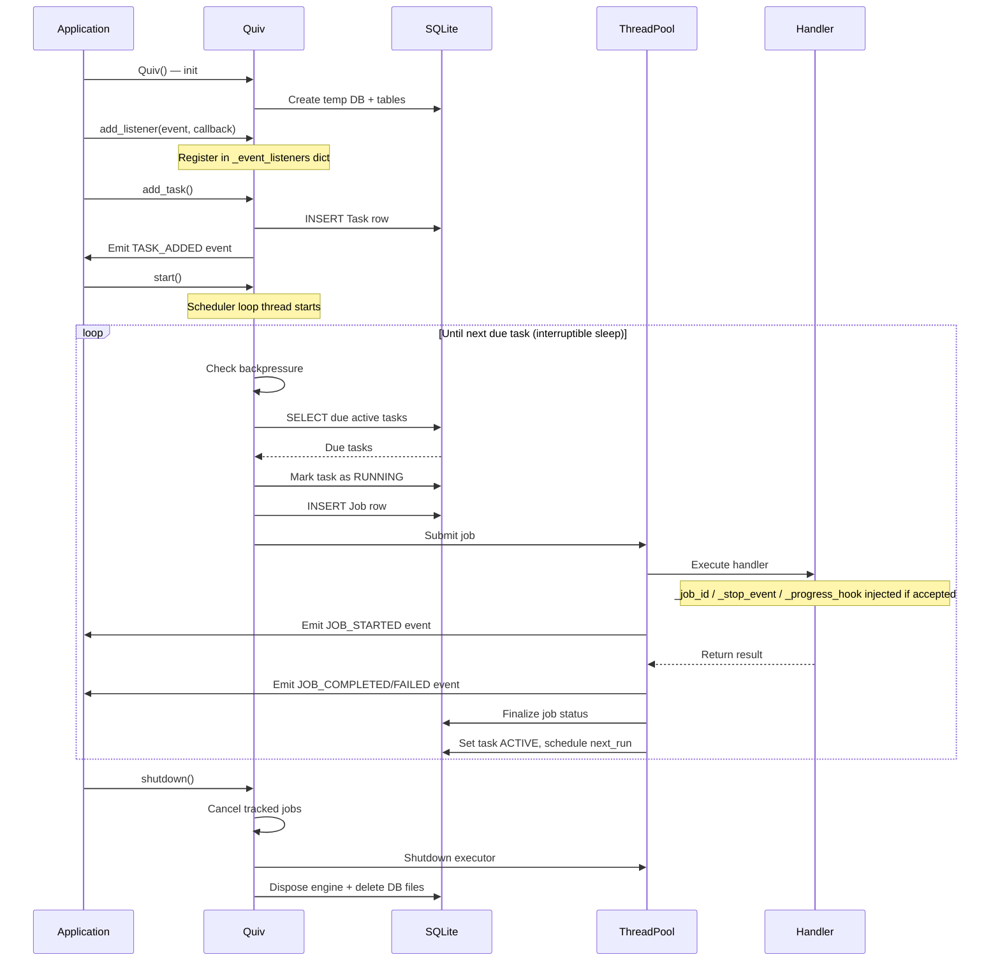

# Architecture

`quiv` is split into focused layers:

- `base` layer (`quiv/base.py`): runtime lifecycle, DB bootstrap, threadpool, callback plumbing, cancellation controls
- `scheduler` layer (`quiv/scheduler.py`): public API and scheduling loop
- `persistence` layer (`quiv/persistence.py`): task/job storage operations
- `execution` layer (`quiv/execution.py`): invocation preparation and sync/async dispatch
- `models` layer (`quiv/models.py`): SQLModel entities and status constants

## Runtime flow

```mermaid
sequenceDiagram
    participant App as Application
    participant Q as Quiv
    participant DB as SQLite
    participant Pool as ThreadPool
    participant H as Handler

    App->>Q: Quiv() — init
    Q->>DB: Create temp DB + tables

    App->>Q: add_listener(event, callback)
    Note over Q: Register in _event_listeners dict

    App->>Q: add_task()
    Q->>DB: INSERT Task row
    Q->>App: Emit TASK_ADDED event

    App->>Q: start()
    Note over Q: Scheduler loop thread starts

    loop Until next due task (interruptible sleep)
        Q->>Q: Check backpressure
        Q->>DB: SELECT due active tasks
        DB-->>Q: Due tasks
        Q->>DB: Mark task as RUNNING
        Q->>DB: INSERT Job row
        Q->>Pool: Submit job
        Pool->>H: Execute handler
        Note over H: _job_id / _stop_event / _progress_hook injected if accepted
        Pool->>App: Emit JOB_STARTED event
        H-->>Pool: Return result
        Pool->>App: Emit JOB_COMPLETED/FAILED event
        Pool->>DB: Finalize job status
        Pool->>DB: Set task ACTIVE, schedule next_run
    end

    App->>Q: shutdown()
    Q->>Q: Cancel tracked jobs
    Q->>Pool: Shutdown executor
    Q->>DB: Dispose engine + delete DB files
```

1. `Quiv(...)` initializes runtime resources
    - resolves timezone
    - creates temporary SQLite database in OS temp directory
    - initializes SQLModel tables
    - creates threadpool executor
2. `add_listener(event, callback)` registers a callback for scheduler events.
    - Listeners can be added at any time.
    - Multiple listeners per event are supported.
3. `add_task(...)` creates a `Task` row with scheduling metadata, then registers the handler and progress callback by `task_id`.

    - Returns a unique `task_id` (UUID string) used for all subsequent task operations.
    - Multiple tasks can share the same `task_name` — each gets its own `task_id`.
    - Emits `TASK_ADDED` event.
    - Tasks can be added before `start()`, after `start()`, or at any point while the scheduler is running.

4. `start()` launches scheduler loop thread.
5. Loop iteration (sleeps until the next due task on an interruptible wait — no fixed polling tick):
    - cleans old job history via SQL-level DELETE (every 60 seconds, via a wall-clock deadline)
    - enforces per-task timeouts: sets the stop event of any running job past its deadline (cooperative, same mechanism as `cancel_job()`)
    - checks backpressure: skips dispatch if all workers are busy
    - selects due active tasks (`next_run_at <= now`, `status == active`)
    - marks task as `running` — prevents concurrent runs of the same task
    - creates a `Job` row for each due task
    - prepares invocation args (inject hooks if supported; each handler's signature is introspected once and cached)
    - submits execution to threadpool
    - emits `JOB_STARTED` event
    - sleeps until the earliest of: next due task, next cleanup deadline, soonest running-job timeout deadline, or a 60-second safety ceiling; `add_task()`, `run_task_immediately()`, `resume_task()`, `remove_task()`, job completion, and `shutdown()` wake the loop early, so schedule changes take effect immediately and an idle scheduler issues no database queries. Sub-second intervals are supported.
6. Job completion:
    - emits `JOB_COMPLETED`, `JOB_FAILED`, or `JOB_CANCELLED` event
    - updates job with terminal status (`completed`, `failed`, `cancelled`); timed-out jobs finalize as `cancelled` with a timeout `error_message`
    - sets task back to `active` and schedules next run (the next strictly-future interval boundary when `fixed_interval=True`, `now + interval` when `False`), plus `uniform(0, jitter)` seconds when jitter is configured
    - on failure with retries remaining, schedules the retry at `now + retry_backoff * 2**(failures - 1)` instead and emits `JOB_RETRYING` after `JOB_FAILED` (cancelled jobs never retry)
    - for run-once tasks, deletes the task row instead (only after retries are exhausted)
    - jobs that started late due to pool saturation log a warning with the delay

## Cancellation model

- each job receives its own `threading.Event` stop signal if handler accepts `_stop_event`
- `cancel_job(job_id)` sets that event when the job is currently tracked
- per-task timeouts use the same mechanism: the scheduler loop sets the stop event when a job exceeds its deadline (see [Failure Handling](failure-handling.md))
- cancellation is cooperative: handler code must check the event

For writing cancellable handlers, shutdown behavior, and status determination logic, see [Cancellation](cancellation.md).

## Progress callback model

- handlers can receive `_progress_hook` when accepted in signature
- calling `_progress_hook(...)` dispatches configured progress callback via `_resolve_main_loop()`
- the main event loop is lazily resolved on first dispatch — `Quiv()` can be instantiated at module level before any asyncio loop exists
- with an event loop available:
    - async callbacks are dispatched via `run_coroutine_threadsafe`
    - sync callbacks are dispatched via `call_soon_threadsafe`
- without an event loop (e.g. plain scripts without asyncio):
    - sync callbacks run directly on the worker thread
    - async callbacks run in a temporary event loop on the worker thread

For dispatch flow details, async/sync examples, and error handling, see [Progress Callbacks](progress-callbacks.md).

## Event listener model

- listeners are registered globally via `add_listener(event, callback)`
- multiple listeners per event are supported, called in registration order
- dispatch uses the same mechanism as progress callbacks:
    - async listeners dispatched via `run_coroutine_threadsafe` on the main loop
    - sync listeners dispatched via `call_soon_threadsafe` on the main loop
    - without a loop: async listeners run in a temporary event loop, sync listeners run directly
- listener exceptions are logged and swallowed — they never block the scheduler or fail a job
- task events (`TASK_ADDED`, `TASK_REMOVED`, `TASK_PAUSED`, `TASK_RESUMED`) fire on the calling thread (whoever called `add_task()`, etc.)
- job events (`JOB_STARTED`, `JOB_COMPLETED`, `JOB_FAILED`, `JOB_CANCELLED`) fire from the worker thread executing the job

For event types, data payloads, and examples, see [Event Listeners](event-listeners.md).

## Async execution model

Async task handlers do not run on the main application event loop. Instead, each async invocation creates a dedicated thread-local event loop, runs the coroutine to completion, and tears down the loop. This ensures async handlers do not interfere with each other or with the main loop.

## Persistence model

- tasks and jobs are persisted in internal SQLite tables:
    - `quiv_task`
    - `quiv_job`
- `quiv` uses a private SQLAlchemy `registry` to keep its metadata separate from user-defined SQLModel models
- datetimes are normalized to UTC-aware values on model load
- history cleanup removes old finished jobs by retention cutoff

## Thread safety

- the scheduler loop runs in a single daemon thread
- task handlers execute in the threadpool (`ThreadPoolExecutor`)
- each handler invocation gets its own stop event and kwargs; there is no shared mutable state between concurrent handler runs
- persistence operations use short-lived `Session` scopes; reads run lock-free under SQLite WAL, while read-modify-write operations serialize on a dedicated write lock
- progress callbacks are dispatched thread-safely onto the main asyncio loop when available, or run directly on the worker thread when no loop exists

## Lifecycle and teardown

- `shutdown()`:
    - requests loop shutdown
    - signals cancellation for tracked running jobs
    - joins scheduler thread
    - shuts down threadpool
    - disposes engine and removes temp DB file
- the temporary SQLite database does not survive process restarts
