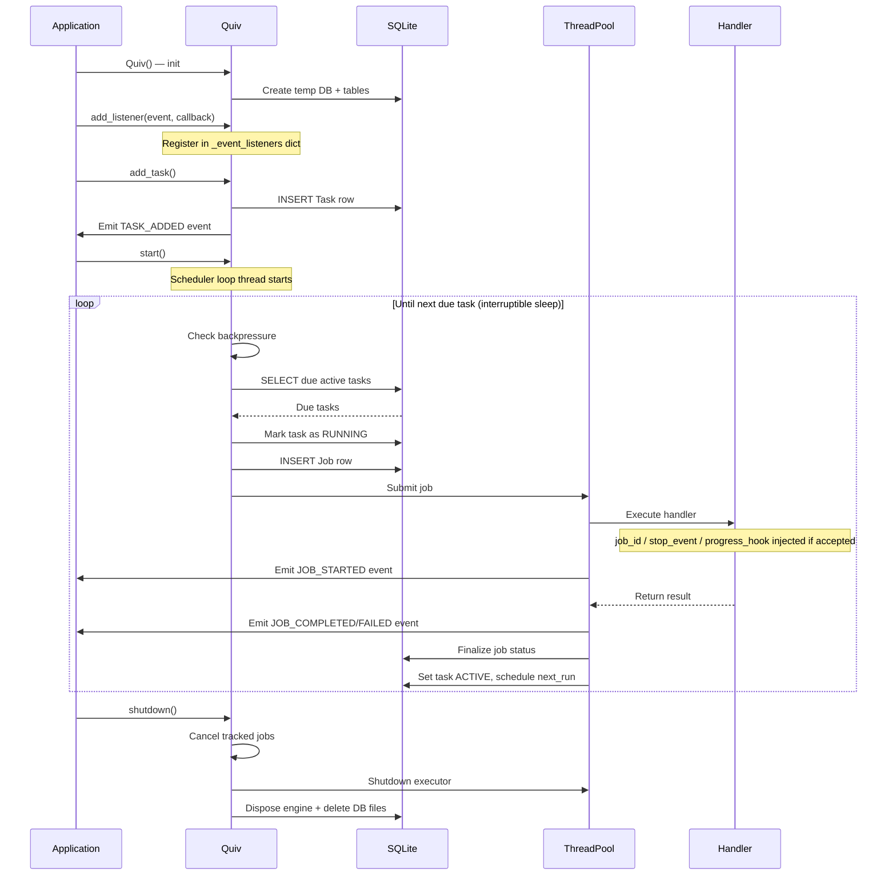

# Architecture

`quiv` is split into focused layers:

- The `base` layer (`quiv/base.py`) owns the runtime lifecycle, the setup of the database, the thread pool, the dispatch of callbacks, and the controls for cancellation.
- The `scheduler` layer (`quiv/scheduler.py`) holds the public API and the scheduling loop.
- The `persistence` layer (`quiv/persistence.py`) stores and reads the tasks and the jobs.
- The `execution` layer (`quiv/execution.py`) prepares each invocation and calls sync and async handlers.
- The `models` layer (`quiv/models.py`) holds the SQLModel entities and the status constants.

## Runtime flow

```mermaid
sequenceDiagram
    participant App as Application
    participant Q as Quiv
    participant DB as SQLite
    participant Pool as ThreadPool
    participant H as Handler

    App->>Q: Quiv() — init
    Q->>DB: Create temp DB + tables

    App->>Q: add_listener(event, callback)
    Note over Q: Register in _event_listeners dict

    App->>Q: add_task()
    Q->>DB: INSERT Task row
    Q->>App: Emit TASK_ADDED event

    App->>Q: start()
    Note over Q: Scheduler loop thread starts

    loop Until next due task (interruptible sleep)
        Q->>Q: Check backpressure
        Q->>DB: SELECT due active tasks
        DB-->>Q: Due tasks
        Q->>DB: Mark task as RUNNING
        Q->>DB: INSERT Job row
        Q->>Pool: Submit job
        Pool->>H: Execute handler
        Note over H: job_id / stop_event / progress_hook injected if accepted
        Pool->>App: Emit JOB_STARTED event
        H-->>Pool: Return result
        Pool->>App: Emit JOB_COMPLETED/FAILED event
        Pool->>DB: Finalize job status
        Pool->>DB: Set task ACTIVE, schedule next_run
    end

    App->>Q: shutdown()
    Q->>Q: Cancel tracked jobs
    Q->>Pool: Shutdown executor
    Q->>DB: Dispose engine + delete DB files
```

1. `Quiv(...)` prepares the runtime resources. It resolves the timezone, creates a temporary SQLite database in the temp directory of the operating system, creates the SQLModel tables, and creates the thread pool.
2. `add_listener(event, callback)` registers a callback for the events of the scheduler. You can add a listener at any time, and each event can have several listeners.
3. `add_task(...)` writes a `Task` row with the scheduling values, then registers the handler and the progress callback under the `task_id`.

    - It returns a unique `task_id`, a UUID string. Every later operation on the task uses it.
    - Several tasks can share one `task_name`. Each task gets its own `task_id`.
    - It emits the `TASK_ADDED` event.
    - You can add a task before `start()`, after `start()`, and at any moment while the scheduler runs.

4. `start()` starts the thread that runs the scheduler loop.
5. Each turn of the loop does the work below. The loop has no fixed polling tick: it sleeps until the next task is due, on a wait that quiv can interrupt.
    - It deletes old job history with one SQL `DELETE`, every 60 seconds, against a wall-clock deadline.
    - It enforces the timeout of each task. It sets the stop event of any running job that passed its deadline. This is cooperative, and it is the mechanism that `cancel_job()` uses.
    - It checks backpressure, and dispatches nothing while every worker is busy.
    - It selects the active tasks that are due, where `next_run_at <= now` and `status == active`.
    - It marks the task `running`, which stops a second run of the same task.
    - It creates one `Job` row for each due task.
    - It prepares the arguments of the invocation, and injects the hooks that the handler accepts. quiv reads the signature of each handler once and keeps the result.
    - It submits the job to the thread pool.
    - It emits the `JOB_STARTED` event.
    - It then sleeps until the earliest of four moments: the next due task, the next cleanup deadline, the nearest timeout deadline of a running job, and a ceiling of 60 seconds.

    Six things wake the loop early: `add_task()`, `run_task_immediately()`, `resume_task()`, `remove_task()`, the completion of a job, and `shutdown()`. A change to the schedule therefore takes effect at once, and an idle scheduler sends no query to the database. Intervals below one second work.

6. When a job completes, quiv does the following:
    - It emits `JOB_COMPLETED`, `JOB_FAILED`, or `JOB_CANCELLED`.
    - It writes the final status to the job: `completed`, `failed`, or `cancelled`. A job that passed its timeout finalizes as `cancelled`, and its `error_message` names the timeout.
    - It sets the task back to `active` and schedules the next run. With `fixed_interval=True` that is the next interval boundary in the future. With `False` it is `now + interval`. quiv adds `uniform(0, jitter)` seconds when the task sets a jitter.
    - If the job failed and retries remain, quiv schedules the retry at `now + retry_backoff * 2**(failures - 1)` instead, and emits `JOB_RETRYING` after `JOB_FAILED`. A cancelled job never retries.
    - For a run-once task, quiv deletes the task row instead, and only after the retries run out.
    - If a job started late because the pool was full, quiv writes a warning that names the delay.

## Cancellation model

- Each job has its own `threading.Event` stop signal. quiv injects it when the handler accepts `stop_event`.
- `cancel_job(job_id)` sets that event while quiv still tracks the job.
- A timeout on a task uses the same mechanism. The scheduler loop sets the stop event when a job passes its deadline. See [Failure Handling](failure-handling.md).
- Cancellation is cooperative. The code of the handler must check the event.

To write a handler that can stop, and to read how shutdown behaves and how quiv decides the final status, see [Cancellation](cancellation.md).

## Progress callback model

- A handler receives `progress_hook` when its signature accepts it.
- A call to `progress_hook(...)` sends the payload to the registered progress callback, through `_resolve_main_loop()`.
- quiv finds the main event loop on the first dispatch, not at startup. You can therefore create `Quiv()` at module level, before any asyncio loop exists.
- With an event loop available:
    - quiv sends an async callback with `run_coroutine_threadsafe`.
    - quiv sends a sync callback with `call_soon_threadsafe`.
- Without an event loop, in a plain script for example:
    - A sync callback runs on the worker thread.
    - An async callback runs in a temporary event loop on the worker thread.

For the full dispatch flow, examples of both kinds, and error handling, see [Progress Callbacks](progress-callbacks.md).

## Event listener model

- You register a listener globally, with `add_listener(event, callback)`.
- One event can have several listeners. quiv calls them in the order of registration.
- Dispatch uses the same mechanism as the progress callbacks:
    - quiv sends an async listener to the main loop with `run_coroutine_threadsafe`.
    - quiv sends a sync listener to the main loop with `call_soon_threadsafe`.
    - Without a loop, an async listener runs in a temporary event loop, and a sync listener runs directly.
- quiv writes an exception from a listener to the log and continues. A listener never blocks the scheduler, and never fails a job.
- The task events (`TASK_ADDED`, `TASK_REMOVED`, `TASK_PAUSED`, `TASK_RESUMED`) fire on the thread of the caller, which is whichever thread called `add_task()` or a similar method.
- The job events (`JOB_STARTED`, `JOB_COMPLETED`, `JOB_FAILED`, `JOB_CANCELLED`) fire from the worker thread that runs the job.

For the event types, their payloads, and examples, see [Event Listeners](event-listeners.md).

## Async execution model

An async task handler does not run on the main event loop of your application. Each async invocation creates its own event loop on the worker thread, runs the coroutine to the end, and closes the loop. Async handlers therefore cannot disturb each other, and cannot disturb the main loop.

## Persistence model

- quiv stores the tasks and the jobs in two internal SQLite tables:
    - `quiv_task`
    - `quiv_job`
- `quiv` uses a private SQLAlchemy `registry`, which keeps its metadata separate from the SQLModel models of your application.
- quiv converts every datetime to an aware UTC value when it loads a model.
- The history cleanup deletes finished jobs that are older than the retention window.

## Thread safety

- The scheduler loop runs in one daemon thread.
- The task handlers run in the thread pool, a `ThreadPoolExecutor`.
- Each invocation of a handler gets its own stop event and its own kwargs. Two handler runs share no mutable state.
- The persistence operations use short `Session` scopes. A read needs no lock under SQLite WAL. An operation that reads, changes, and writes takes a dedicated write lock, one at a time.
- quiv sends a progress callback to the main asyncio loop in a thread-safe way when a loop is available. Without a loop, the callback runs on the worker thread.

## Lifecycle and teardown

- `shutdown()` does five things, in order:
    - It asks the loop to stop.
    - It sets the stop event of every running job that it tracks.
    - It joins the scheduler thread.
    - It shuts down the thread pool.
    - It disposes the engine and deletes the temporary database file.
- The temporary SQLite database does not survive a restart of the process.
