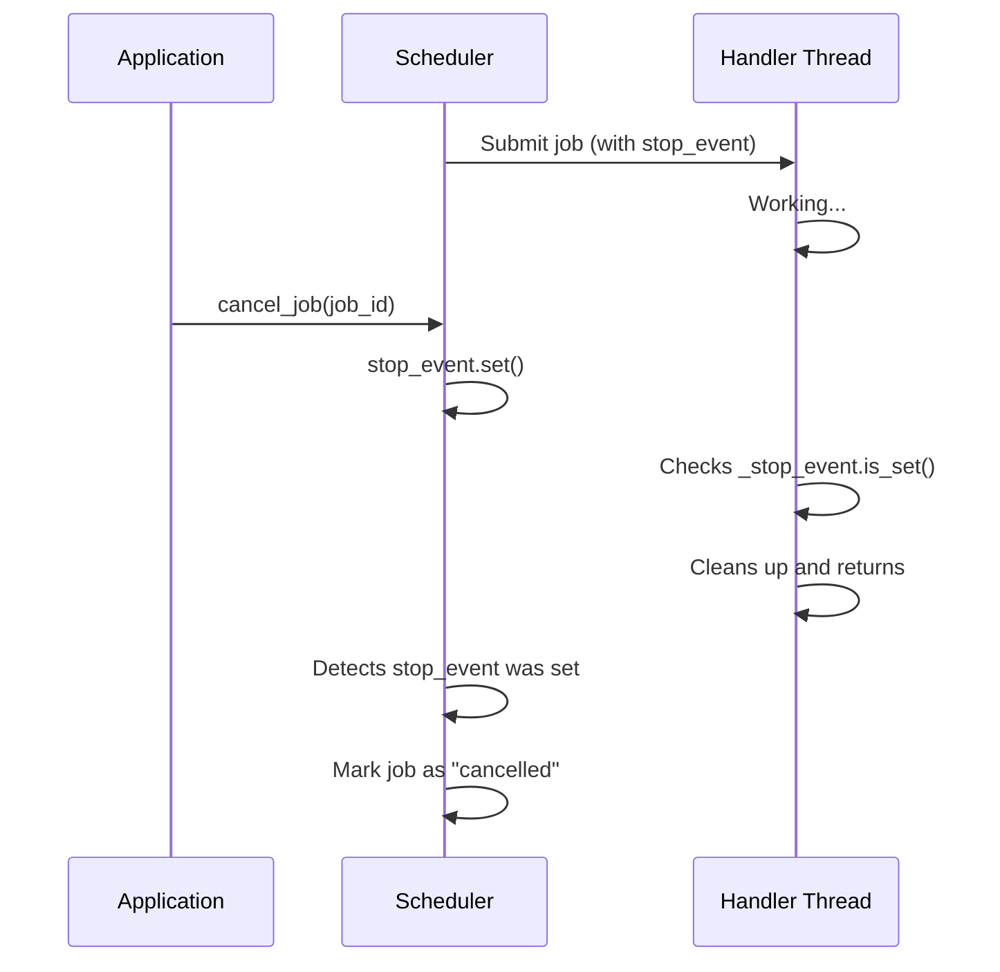
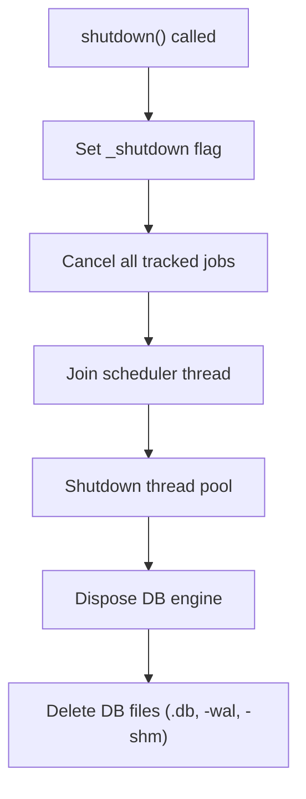
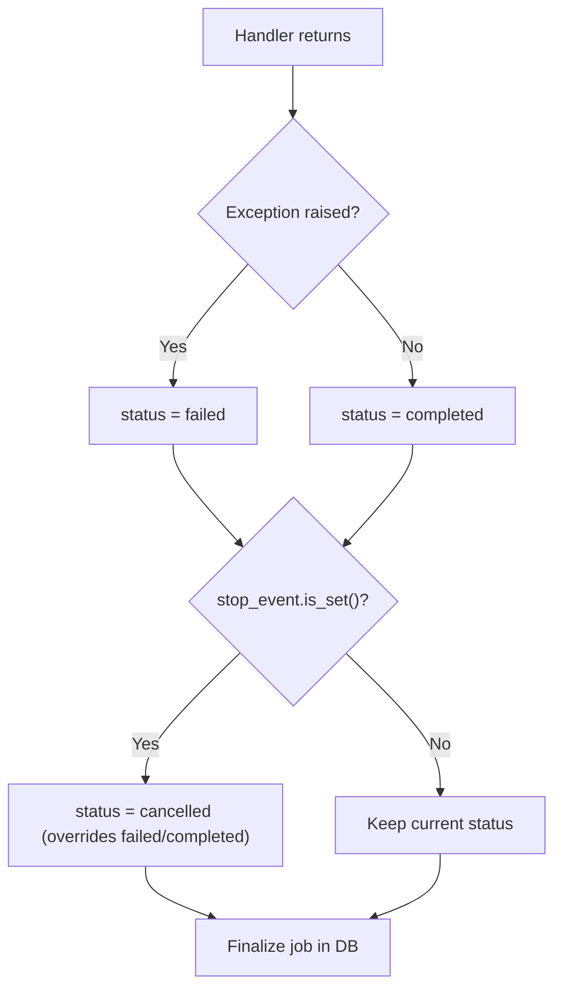

# Cancellation

quiv uses cooperative cancellation via `threading.Event`. This gives handlers
full control over how and when they stop, enabling clean resource cleanup and
graceful shutdown.

## How it works

Each job gets its own `threading.Event` stop signal. When cancellation is
requested, the event is set. The handler checks the event and decides how to
respond.



### Key points

- Cancellation is **cooperative** — the handler must check `_stop_event` to
  actually stop. quiv cannot force-kill a running thread.
- The handler decides **when** to check and **how** to clean up.
- Job status is automatically set to `cancelled` if the stop event was set
  when the handler returns, regardless of whether the handler accepted
  `_stop_event` in its signature.

## Writing a cancellable handler

Add `_stop_event` to your handler's signature. quiv inspects the signature
and only injects it if the parameter is present.

```python
import threading
import time


def long_running_task(
    _stop_event: threading.Event | None = None,
):
    """A task that processes items and can be cancelled between steps."""
    items = fetch_items()

    for item in items:
        if _stop_event and _stop_event.is_set():
            # Clean up and exit gracefully
            return

        process(item)
        time.sleep(0.1)
```

### Check frequency

Check `_stop_event` at natural breakpoints in your handler:

- Between iterations of a loop
- Before starting an expensive operation
- After completing a unit of work

```python
def batch_processor(
    _stop_event: threading.Event | None = None,
    _progress_hook: Callable | None = None,
):
    batches = get_batches()

    for i, batch in enumerate(batches):
        # Check before each batch
        if _stop_event and _stop_event.is_set():
            return

        result = process_batch(batch)  # might take a while
        save_result(result)

        if _progress_hook:
            _progress_hook(step=i + 1, total=len(batches))
```

### Using `_stop_event.wait()` instead of `time.sleep()`

If your handler has a sleep/wait period, use `_stop_event.wait()` instead of
`time.sleep()`. This makes cancellation responsive even during wait periods:

```python
def polling_task(
    _stop_event: threading.Event | None = None,
):
    """Poll an API every 5 seconds, but respond to cancellation immediately."""
    while not (_stop_event and _stop_event.is_set()):
        result = check_api()
        if result.ready:
            handle_result(result)
            return

        # Wait 5 seconds OR until cancelled — whichever comes first
        if _stop_event:
            _stop_event.wait(timeout=5)
        else:
            time.sleep(5)
```

This pattern is especially useful for tasks that poll external services.

## Cancelling a job

Use `cancel_job(job_id)` to signal cancellation:

```python
# Find running jobs
jobs = scheduler.get_all_jobs(status="running")

# Cancel a specific job
for job in jobs:
    scheduler.cancel_job(job.id)
```

`cancel_job` returns `True` if the stop event was found and set, `False` if
the job was not found (already finished or invalid ID).

## Cancellation during shutdown

When `shutdown()` is called, quiv automatically cancels all tracked running
jobs by setting their stop events. Handlers that check `_stop_event` will
exit gracefully; handlers that don't will run to completion before the
process exits.



## How status is determined

When a job finishes, quiv checks the stop event to determine the final status.
This happens in the `finally` block of `_run_job`, so it works regardless of
how the handler exited:



Note that `cancelled` takes priority over both `completed` and `failed`. If
a handler raises an exception *and* the stop event is set, the job is marked
as `cancelled` — the assumption is that the cancellation caused the error.

## Handlers without `_stop_event`

If your handler's signature does not include `_stop_event` (and does not use
`**kwargs`), the event is **not injected** — but it is still tracked
internally. This means:

- `cancel_job()` still sets the event
- The job status is still set to `cancelled` if the event was set when the
  handler returns
- The handler itself just can't respond to cancellation early

This is useful for short-lived tasks where you don't need mid-execution
cancellation but still want correct status tracking on shutdown.

## Combining with progress callbacks

A common pattern is to check `_stop_event` and report progress in the same
loop:

```python
def export_data(
    format: str,
    _stop_event: threading.Event | None = None,
    _progress_hook: Callable | None = None,
):
    records = query_records()
    total = len(records)

    for i, record in enumerate(records, 1):
        if _stop_event and _stop_event.is_set():
            return

        write_record(record, format)

        if _progress_hook and i % 100 == 0:
            _progress_hook(
                step=i,
                total=total,
                pct=round(i / total * 100),
            )
```

The progress callback and stop event are independent — you can use either or
both. quiv injects each one only if the handler's signature accepts it.
