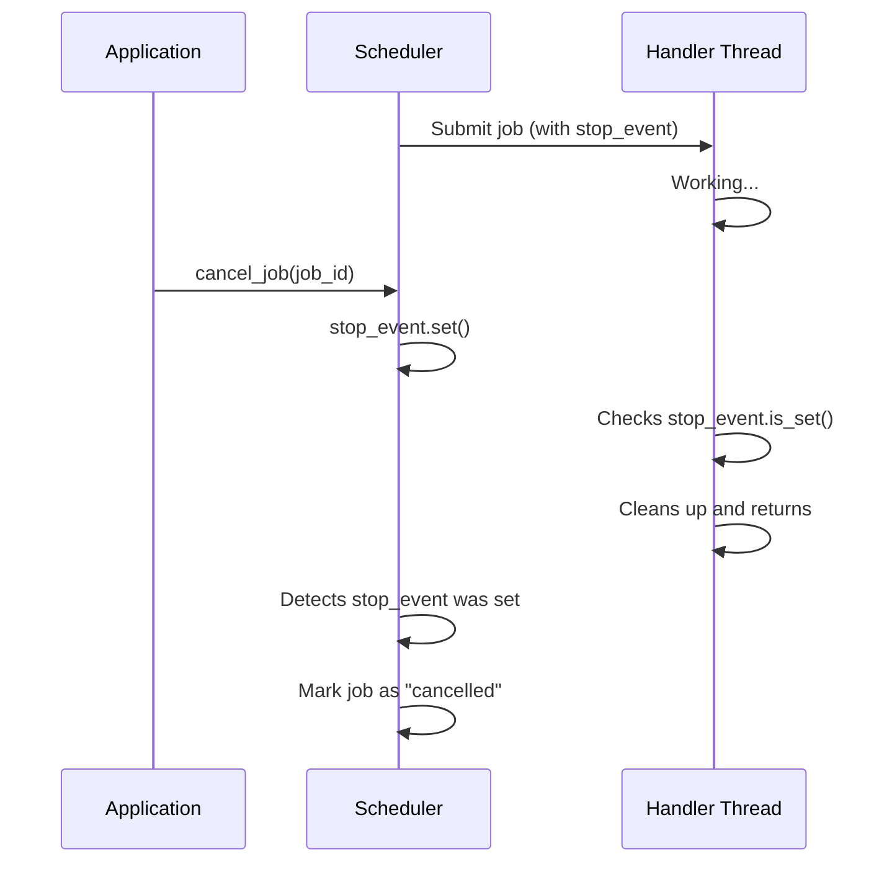
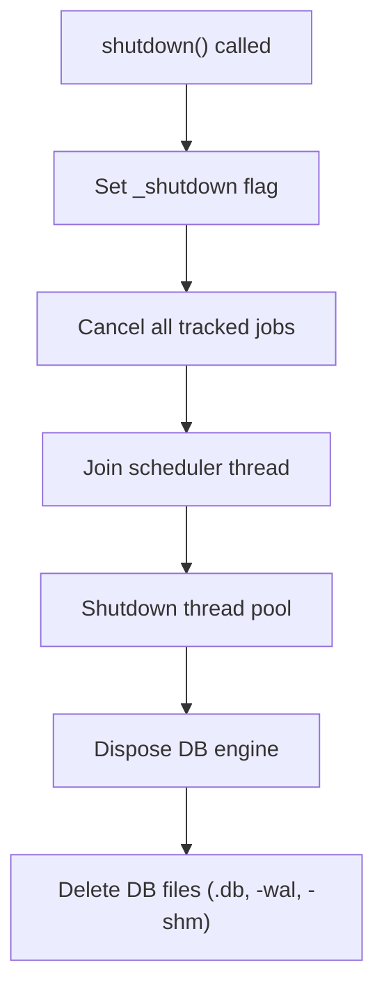
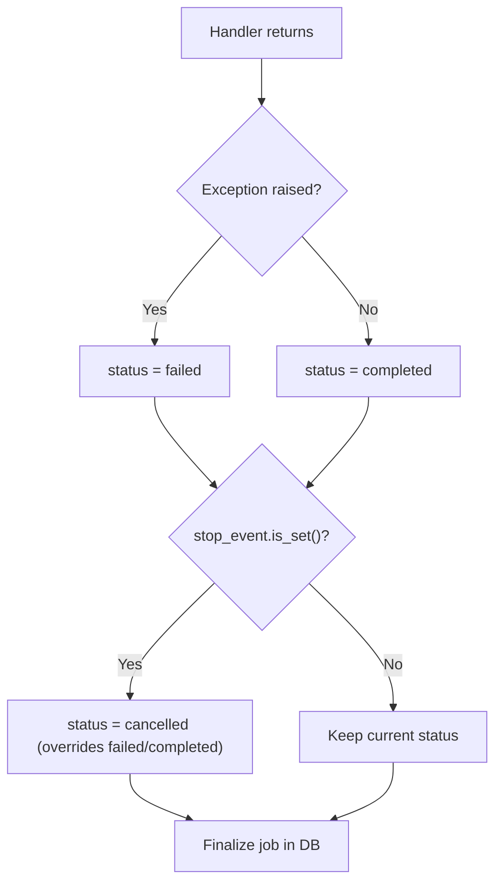

# Cancellation

quiv cancels a job cooperatively, with a `threading.Event`. The handler keeps full control of when it stops and of how it stops. It can release its resources first, and it can finish the unit of work it started.

## How it works

Each job has its own `threading.Event`, which is its stop signal. quiv sets the event when something asks for a cancellation. The handler reads the event and decides what to do.

Three things set the stop event of a job:

- `cancel_job(job_id)`.
- `remove_task()` and `shutdown()`, for a job that is running.
- A timeout on the task, from `add_task(..., timeout=30)`. A timeout is a cancellation through this same mechanism. See [Failure Handling](failure-handling.md).


```mermaid
sequenceDiagram
    participant App as Application
    participant S as Scheduler
    participant H as Handler Thread

    S->>H: Submit job (with stop_event)
    H->>H: Working...
    App->>S: cancel_job(job_id)
    S->>S: stop_event.set()
    H->>H: Checks stop_event.is_set()
    H->>H: Cleans up and returns
    S->>S: Detects stop_event was set
    S->>S: Mark job as "cancelled"
```

### Key points

- Cancellation is **cooperative**. The handler must check `stop_event` to stop. quiv never kills a thread.
- The handler decides **when** to check, and **how** to release its resources.
- quiv sets the job status to `cancelled` if the stop event was set when the handler returned. This happens even when the handler does not declare `stop_event`.

## Writing a handler that can stop

Add `stop_event` to the signature of your handler. quiv reads the signature and injects the event only when the parameter is there.

!!! warning "Renamed in v1.0.0 — was `_stop_event`"

    quiv `0.x` injected this parameter as `_stop_event`. `add_task()` rejects a handler that still declares the old name, and raises `ConfigurationError` that names the new spelling. Rename the parameter. Its behavior is unchanged. See the [v1.0.0 release notes](release-notes.md#v1.0.0).

```python
import threading
import time


def long_running_task(
    stop_event: threading.Event | None = None,
):
    """A task that processes items and can be cancelled between steps."""
    items = fetch_items()

    for item in items:
        if stop_event and stop_event.is_set():
            # Clean up and exit gracefully
            return

        process(item)
        time.sleep(0.1)
```

### How often to check

Check `stop_event` at the natural breakpoints of your handler:

- Between two turns of a loop.
- Before an operation that costs a lot of time.
- After you finish one unit of work.

```python
def batch_processor(
    stop_event: threading.Event | None = None,
    progress_hook: Callable | None = None,
):
    batches = get_batches()

    for i, batch in enumerate(batches):
        # Check before each batch
        if stop_event and stop_event.is_set():
            return

        result = process_batch(batch)  # might take a while
        save_result(result)

        if progress_hook:
            progress_hook(step=i + 1, total=len(batches))
```

### Use `stop_event.wait()` in place of `time.sleep()`

If your handler waits for a period, call `stop_event.wait()` rather than `time.sleep()`. The handler then stops during the wait, instead of after it.

```python
def polling_task(
    stop_event: threading.Event | None = None,
):
    """Poll an API every 5 seconds, but respond to cancellation immediately."""
    while not (stop_event and stop_event.is_set()):
        result = check_api()
        if result.ready:
            handle_result(result)
            return

        # Wait 5 seconds OR until cancelled — whichever comes first
        if stop_event:
            stop_event.wait(timeout=5)
        else:
            time.sleep(5)
```

Use this pattern for a task that polls an external service.

## Cancelling a job

Call `cancel_job(job_id)` to send the signal:

```python
# Find running jobs
jobs = scheduler.get_all_jobs(status="running")

# Cancel a specific job
for job in jobs:
    scheduler.cancel_job(job.id)
```

`cancel_job()` returns `True` when it finds the stop event and sets it. It returns `False` when it finds no job, which means the job already finished or the id is wrong.

## Cancellation during shutdown

`shutdown()` cancels every running job that quiv tracks, by setting the stop event of each one. A handler that checks `stop_event` returns early. A handler that does not check it runs to the end, and the process waits.


```mermaid
flowchart TD
    A["shutdown() called"] --> B[Set _shutdown flag]
    B --> C[Cancel all tracked jobs]
    C --> D[Join scheduler thread]
    D --> E[Shutdown thread pool]
    E --> F[Dispose DB engine]
    F --> G["Delete DB files (.db, -wal, -shm)"]
```

## How quiv decides the status

When a job finishes, quiv reads the stop event and sets the final status. It does this in the `finally` block of `_run_job`, so the result is the same however the handler exited.


```mermaid
flowchart TD
    A[Handler returns] --> B{Exception raised?}
    B -- Yes --> C["status = failed"]
    B -- No --> D["status = completed"]
    C --> E{"stop_event.is_set()?"}
    D --> E
    E -- Yes --> F["status = cancelled (overrides failed/completed)"]
    E -- No --> G[Keep current status]
    F --> H[Finalize job in DB]
    G --> H
```

`cancelled` wins over `completed` and over `failed`. If a handler raises an exception and the stop event is also set, quiv marks the job `cancelled`, because the cancellation is the more likely cause of the error.

## Handlers without `stop_event`

If the signature of your handler has no `stop_event` and no `**kwargs`, quiv does not inject the event. It still creates the event and tracks it. Three things follow:

- `cancel_job()` still sets the event.
- quiv still sets the job status to `cancelled` if the event was set when the handler returned.
- The handler cannot return early, because it never sees the event.

Write a handler this way when the task is short. You give up the early exit, and you keep the correct status at shutdown.

## Subprocesses

A stop event cannot reach a child process. A handler that checks the event between steps still waits for the running child, so yt-dlp or ffmpeg runs to its end or to its own timeout. `run_subprocess` closes that gap:

```python
from quiv import run_subprocess

def convert(path: str) -> None:
    run_subprocess(["ffmpeg", "-i", path, "-c:v", "libx264", out(path)], timeout=900)
```

It is a drop-in for `subprocess.run`. While the child runs, quiv watches the job's stop event. When the event is set, the child gets `terminate()`, then `kill()` after `kill_grace` seconds if it is still alive, and the helper raises `JobCancelledError`. The default grace is 5 seconds. A `timeout` stops the child the same way and raises `subprocess.TimeoutExpired`, as the stdlib does.

The stop event is found through the job context, so the call above needs no `stop_event` parameter, at any depth in the handler's call stack. Pass `stop_event=` yourself when the call runs on a thread you started, which the context does not reach.

The helper stops the direct child only. A child that starts children of its own can leave them running; pass `start_new_session=True` to give it a process group of its own. On Windows `terminate()` and `kill()` are the same call.

## Helpers raise `JobCancelledError`

`run_subprocess` and [`call_on_main`](run-on-main.md#waiting-for-the-result-with-call_on_main) both wait on something, and both raise `JobCancelledError` when the job's stop event is set while they wait. Let it propagate. quiv treats it as the stop you asked for: the job finalizes as `cancelled`, the log gets one info line, and `error_message` stays empty, or holds the timeout text when a timeout set the event.

A handler that catches `Exception` around the call swallows the cancellation and keeps running, exactly as a handler that ignores its stop event does. Catch what you need and re-raise, or catch `JobCancelledError` first and return.

Raised by hand with no stop requested, `JobCancelledError` is an ordinary exception, and the job fails.

## Combining with progress callbacks

Many handlers check `stop_event` and report progress in the same loop:

```python
def export_data(
    format: str,
    stop_event: threading.Event | None = None,
    progress_hook: Callable | None = None,
):
    records = query_records()
    total = len(records)

    for i, record in enumerate(records, 1):
        if stop_event and stop_event.is_set():
            return

        write_record(record, format)

        if progress_hook and i % 100 == 0:
            progress_hook(
                step=i,
                total=total,
                pct=round(i / total * 100),
            )
```

The progress callback and the stop event do not depend on each other. Use one, or both. quiv injects each one only when the signature of the handler accepts it.
