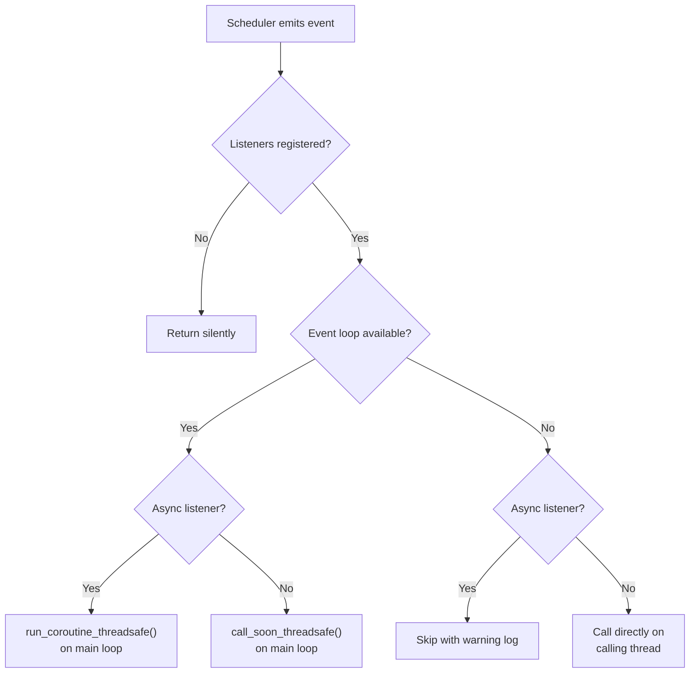
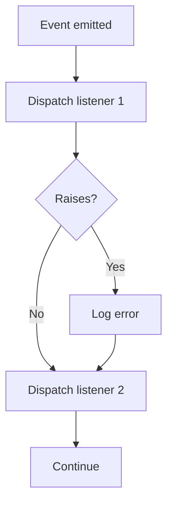

# Event Listeners

Event listeners let you react to scheduler lifecycle events — tasks being
added, removed, paused, or resumed, and jobs starting, completing, failing,
or being cancelled. This is useful for logging, metrics, alerting, or
updating UI state.

## How it works

Register a callback for one or more `Event` types via `add_listener()`.
When the event fires, quiv dispatches your callback on the main event loop
(same dispatch model as [progress callbacks](progress-callbacks.md)).



### Dispatch paths

| Event loop | Listener type | What happens |
|------------|--------------|--------------|
| Available | Async | Dispatched via `run_coroutine_threadsafe` on the main loop |
| Available | Sync | Dispatched via `call_soon_threadsafe` on the main loop |
| Unavailable | Sync | Called directly on the calling thread |
| Unavailable | Async | Skipped with a warning log |

## Events

All events are defined in the `Event` enum:

| Event | When it fires | Data keys |
|-------|--------------|-----------|
| `TASK_ADDED` | After `add_task()` completes | `task_name`, `task_id` |
| `TASK_REMOVED` | After `remove_task()` completes | `task_name`, `task_id` |
| `TASK_PAUSED` | After `pause_task()` completes | `task_name`, `task_id` |
| `TASK_RESUMED` | After `resume_task()` completes | `task_name`, `task_id` |
| `JOB_STARTED` | When a job begins execution | `task_name`, `job_id` |
| `JOB_COMPLETED` | When a job finishes successfully | `task_name`, `job_id`, `duration` |
| `JOB_FAILED` | When a job ends with an exception | `task_name`, `job_id`, `error`, `duration` |
| `JOB_CANCELLED` | When a job is cancelled via stop event | `task_name`, `job_id` |

## Callback signature

Every event listener receives two arguments:

```python
def my_listener(event: Event, data: dict[str, Any]) -> None:
    ...
```

- `event` — the `Event` enum member that was emitted
- `data` — a dict with context keys specific to the event (see table above)

Async callbacks use the same signature:

```python
async def my_listener(event: Event, data: dict[str, Any]) -> None:
    ...
```

### Data fields

- `task_name` (`str`) — the name of the task
- `task_id` (`str`) — the UUID of the task
- `job_id` (`int`) — the integer job ID
- `duration` (`timedelta`) — how long the job ran
- `error` (`BaseException`) — the exception that caused the failure (only on `JOB_FAILED`)

## Registering listeners

Use `add_listener()` to register a callback for a specific event:

```python
from quiv import Quiv, Event

scheduler = Quiv()


def on_task_added(event: Event, data: dict) -> None:
    print(f"Task '{data['task_name']}' added with ID {data['task_id']}")


scheduler.add_listener(Event.TASK_ADDED, on_task_added)
```

### Multiple listeners

You can register multiple listeners for the same event. They are called in
registration order:

```python
scheduler.add_listener(Event.JOB_FAILED, log_failure)
scheduler.add_listener(Event.JOB_FAILED, send_alert)
```

### Multiple events

Register the same callback for different events:

```python
def audit_log(event: Event, data: dict) -> None:
    print(f"[{event.value}] {data}")

scheduler.add_listener(Event.TASK_ADDED, audit_log)
scheduler.add_listener(Event.TASK_REMOVED, audit_log)
scheduler.add_listener(Event.JOB_FAILED, audit_log)
```

## Removing listeners

Use `remove_listener()` to unregister a previously added callback:

```python
scheduler.remove_listener(Event.TASK_ADDED, on_task_added)
```

If the callback is not found, the call is silently ignored.

## Async listeners

Async listeners run on the main event loop via `run_coroutine_threadsafe`,
just like async progress callbacks. This makes them ideal for FastAPI apps
where you want to broadcast events to WebSocket clients:

```python
async def on_job_completed(event: Event, data: dict) -> None:
    await ws_manager.broadcast({
        "type": "job_completed",
        "task": data["task_name"],
        "duration": str(data["duration"]),
    })

scheduler.add_listener(Event.JOB_COMPLETED, on_job_completed)
```

## Error handling

If a listener raises an exception, quiv logs the error but does **not**
fail the scheduler or the job. Other listeners for the same event still run.
This prevents a broken listener from disrupting task execution.



## Without an event loop

In scripts without asyncio, sync event listeners work normally — they run
directly on the calling thread:

```python
from quiv import Quiv, Event

scheduler = Quiv()


def on_added(event: Event, data: dict) -> None:
    print(f"Added: {data['task_name']}")


scheduler.add_listener(Event.TASK_ADDED, on_added)
scheduler.add_task("my-task", lambda: None, interval=10)
# Prints: Added: my-task
```

Async listeners are skipped with a warning log when no event loop is
available, since there is no loop to dispatch them on.

## FastAPI example

A complete example wiring event listeners into a FastAPI app with WebSocket
notifications:

```python
import logging
from contextlib import asynccontextmanager
from typing import Any

from fastapi import FastAPI, WebSocket, WebSocketDisconnect

from quiv import Event, Quiv

scheduler = Quiv(timezone="UTC")
logger = logging.getLogger(__name__)

connected_clients: list[WebSocket] = []


async def broadcast(message: dict) -> None:
    for ws in connected_clients:
        try:
            await ws.send_json(message)
        except Exception:
            pass


async def on_job_event(event: Event, data: dict[str, Any]) -> None:
    """Broadcast job lifecycle events to WebSocket clients."""
    payload: dict[str, Any] = {
        "event": event.value,
        "task_name": data["task_name"],
        "job_id": data.get("job_id"),
    }
    if "duration" in data:
        payload["duration_seconds"] = data["duration"].total_seconds()
    if "error" in data:
        payload["error"] = str(data["error"])
    await broadcast(payload)


def sync_task() -> None:
    pass  # your task logic


@asynccontextmanager
async def lifespan(app: FastAPI):
    # Register event listeners
    scheduler.add_listener(Event.JOB_STARTED, on_job_event)
    scheduler.add_listener(Event.JOB_COMPLETED, on_job_event)
    scheduler.add_listener(Event.JOB_FAILED, on_job_event)
    scheduler.add_listener(Event.JOB_CANCELLED, on_job_event)

    scheduler.add_task("my-task", sync_task, interval=60)
    scheduler.start()
    yield
    scheduler.shutdown()


app = FastAPI(lifespan=lifespan)


@app.websocket("/ws/events")
async def events_websocket(websocket: WebSocket):
    await websocket.accept()
    connected_clients.append(websocket)
    try:
        while True:
            await websocket.receive_text()
    except WebSocketDisconnect:
        connected_clients.remove(websocket)
```
