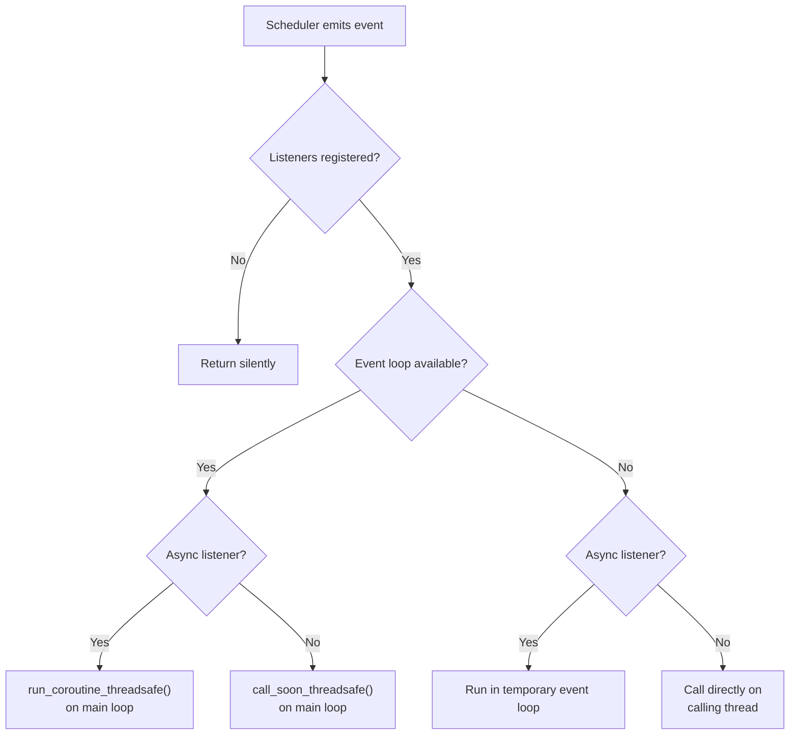
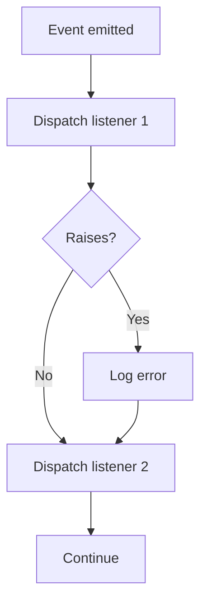

# Event Listeners

An event listener lets your code react to what the scheduler does. quiv emits an event when it adds, removes, pauses, resumes, or updates a task, and when a job starts, completes, fails, retries, or is cancelled. Use a listener to write a log, record a metric, raise an alert, or update what a user sees.

## How it works

Register a callback for one or more `Event` types with `add_listener()`. When the event fires, quiv sends your callback to the main event loop. It uses the same dispatch model as the [progress callbacks](progress-callbacks.md).


```mermaid
flowchart TD
    A["Scheduler emits event"] --> B{Listeners registered?}
    B -- No --> C[Return silently]
    B -- Yes --> D{Event loop available?}
    D -- Yes --> E{Async listener?}
    D -- No --> F{Async listener?}
    E -- Yes --> G["run_coroutine_threadsafe()
    on main loop"]
    E -- No --> H["call_soon_threadsafe()
    on main loop"]
    F -- Yes --> I["Run in temporary event loop"]
    F -- No --> J["Call directly on
    calling thread"]
```

### Dispatch paths

| Event loop | Listener type | What quiv does |
|------------|--------------|--------------|
| Available | Async | Sends it to the main loop with `run_coroutine_threadsafe` |
| Available | Sync | Sends it to the main loop with `call_soon_threadsafe` |
| Unavailable | Sync | Calls it on the calling thread |
| Unavailable | Async | Runs it in a temporary event loop on the calling thread |

## Events

All events are defined in the `Event` enum:

| Event | When it fires | Callback receives |
|-------|--------------|-------------------|
| `TASK_ADDED` | After `add_task()` completes | `event`, `task` |
| `TASK_REMOVED` | After `remove_task()` completes | `event`, `task`[^1] |
| `TASK_PAUSED` | After `pause_task()` completes | `event`, `task` |
| `TASK_RESUMED` | After `resume_task()` completes | `event`, `task` |
| `TASK_UPDATED` | After `update_task()` changes a task. The payload carries the task as it is after the change | `event`, `task` |
| `JOB_STARTED` | When a job begins execution | `event`, `task`, `job` |
| `JOB_COMPLETED` | When a job finishes successfully | `event`, `task`, `job` |
| `JOB_FAILED` | When a job ends with an exception | `event`, `task`, `job` |
| `JOB_RETRYING` | After `JOB_FAILED`, when quiv has scheduled a retry for the task of the failed job | `event`, `task`, `job` |
| `JOB_CANCELLED` | When a stop event cancels a job | `event`, `task`, `job` |

[^1]: For `TASK_REMOVED`, the `task` object is a snapshot taken before deletion.

## Callback signatures

A listener receives typed model objects, so its inputs are always the same shape. The signature depends on the group of the event:

### Task events (`TASK_*`)

```python
from quiv import Event
from quiv.models import Task

def on_task_event(event: Event, task: Task) -> None:
    print(f"[{event.value}] Task '{task.task_name}' (id={task.id})")
```

### Job events (`JOB_*`)

```python
from quiv import Event
from quiv.models import Task, Job

def on_job_event(event: Event, task: Task, job: Job) -> None:
    print(f"[{event.value}] Job {job.id} for '{task.task_name}'")
    if job.duration_seconds is not None:
        print(f"  Duration: {job.duration_seconds:.2f}s")
    if job.error_message is not None:
        print(f"  Error: {job.error_message}")
```

Async callbacks use the same signatures:

```python
async def on_task_event(event: Event, task: Task) -> None:
    ...

async def on_job_event(event: Event, task: Task, job: Job) -> None:
    ...
```

!!! tip "Full type safety"
    A listener receives `Task` and `Job` model objects, so your editor completes every field and your type checker reads them. You never have to guess the key of a dictionary.

## Registering listeners

Use `add_listener()` to register a callback for a specific event:

```python
from quiv import Quiv, Event
from quiv.models import Task

scheduler = Quiv()


def on_task_added(event: Event, task: Task) -> None:
    print(f"Task '{task.task_name}' added with ID {task.id}")


scheduler.add_listener(Event.TASK_ADDED, on_task_added)
```

### Multiple listeners

You can register multiple listeners for the same event. They are called in registration order:

```python
scheduler.add_listener(Event.JOB_FAILED, log_failure)
scheduler.add_listener(Event.JOB_FAILED, send_alert)
```

### Multiple events

Register the same callback for different events within the same event group:

```python
from quiv.models import Task, Job

def job_audit_log(event: Event, task: Task, job: Job) -> None:
    print(f"[{event.value}] task={task.task_name} job={job.id}")

scheduler.add_listener(Event.JOB_COMPLETED, job_audit_log)
scheduler.add_listener(Event.JOB_FAILED, job_audit_log)
```

## Removing listeners

Use `remove_listener()` to unregister a previously added callback:

```python
scheduler.remove_listener(Event.TASK_ADDED, on_task_added)
```

If quiv does not find the callback, the call does nothing and raises nothing.

## Async listeners

An async listener runs on the main event loop, through `run_coroutine_threadsafe`. An async progress callback works the same way. Use an async listener in a FastAPI application to send events to WebSocket clients:

```python
from quiv.models import Task, Job

async def on_job_completed(event: Event, task: Task, job: Job) -> None:
    await ws_manager.broadcast({
        "type": "job_completed",
        "task": task.task_name,
        "duration_seconds": job.duration_seconds,
    })

scheduler.add_listener(Event.JOB_COMPLETED, on_job_completed)
```

## Error handling

If a listener raises an exception, quiv writes the error to the log. The scheduler continues, and the job does **not** fail. The other listeners for the same event still run. One broken listener therefore cannot stop your tasks.


```mermaid
flowchart TD
    A["Event emitted"] --> B["Dispatch listener 1"]
    B --> C{Raises?}
    C -- No --> D["Dispatch listener 2"]
    C -- Yes --> E["Log error"]
    E --> D
    D --> F["Continue"]
```

## Without an event loop

A sync listener works in a script that does not use asyncio. It runs on the calling thread:

```python
from quiv import Quiv, Event
from quiv.models import Task

scheduler = Quiv()


def on_added(event: Event, task: Task) -> None:
    print(f"Added: {task.task_name}")


scheduler.add_listener(Event.TASK_ADDED, on_added)
scheduler.add_task("my-task", lambda: None, interval=10)
# Prints: Added: my-task
```

An async listener works without an event loop too. quiv runs it in a temporary event loop on the calling thread, so an `await` inside the listener runs correctly.

## FastAPI example

This example puts event listeners into a FastAPI application and sends each event to the WebSocket clients:

```python
import logging
from contextlib import asynccontextmanager
from typing import Any

from fastapi import FastAPI, WebSocket, WebSocketDisconnect

from quiv import Event, Quiv
from quiv.models import Task, Job

scheduler = Quiv(timezone="UTC")
logger = logging.getLogger(__name__)

connected_clients: list[WebSocket] = []


async def broadcast(message: dict) -> None:
    for ws in connected_clients:
        try:
            await ws.send_json(message)
        except Exception:
            pass


async def on_job_event(event: Event, task: Task, job: Job) -> None:
    """Broadcast job lifecycle events to WebSocket clients."""
    payload: dict[str, Any] = {
        "event": event.value,
        "task_name": task.task_name,
        "job_id": job.id,
    }
    if job.duration_seconds is not None:
        payload["duration_seconds"] = job.duration_seconds
    if job.error_message is not None:
        payload["error"] = job.error_message
    await broadcast(payload)


def sync_task() -> None:
    pass  # your task logic


@asynccontextmanager
async def lifespan(app: FastAPI):
    # Register event listeners
    scheduler.add_listener(Event.JOB_STARTED, on_job_event)
    scheduler.add_listener(Event.JOB_COMPLETED, on_job_event)
    scheduler.add_listener(Event.JOB_FAILED, on_job_event)
    scheduler.add_listener(Event.JOB_CANCELLED, on_job_event)

    scheduler.add_task("my-task", sync_task, interval=60)
    scheduler.start()
    yield
    scheduler.shutdown()


app = FastAPI(lifespan=lifespan)


@app.websocket("/ws/events")
async def events_websocket(websocket: WebSocket):
    await websocket.accept()
    connected_clients.append(websocket)
    try:
        while True:
            await websocket.receive_text()
    except WebSocketDisconnect:
        connected_clients.remove(websocket)
```
