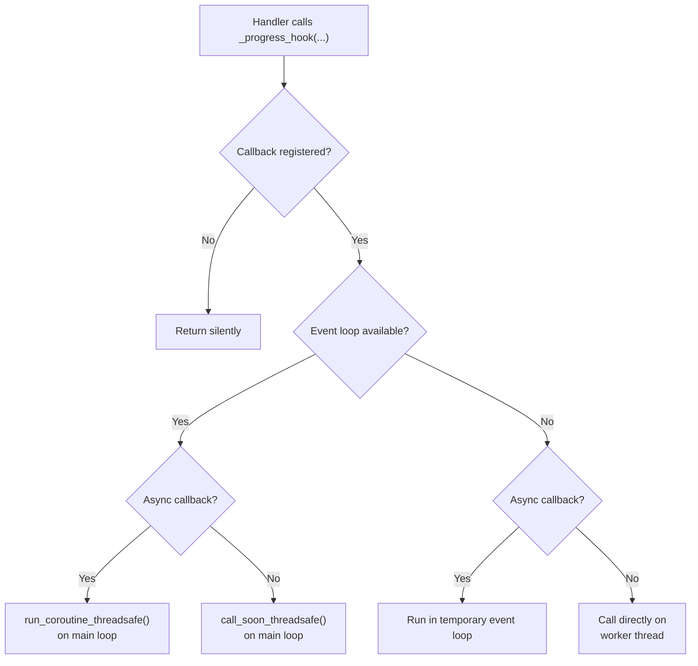
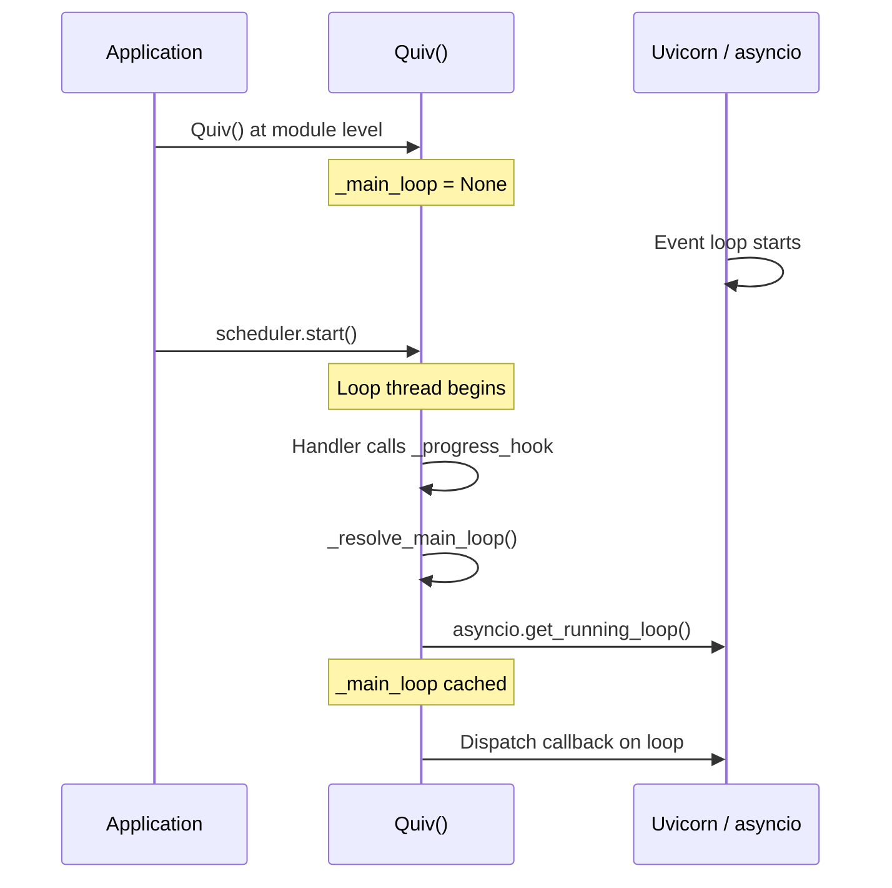
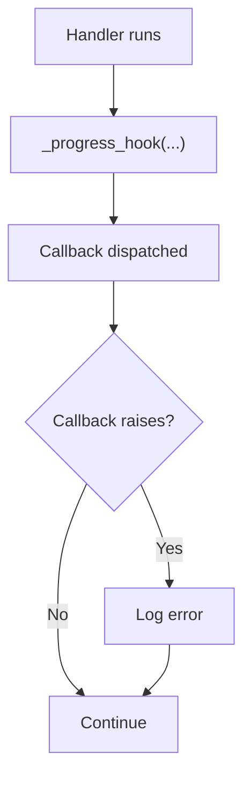

# Progress Callbacks

Progress callbacks let task handlers report live progress back to your
application. This is useful for updating UIs, broadcasting WebSocket messages,
logging metrics, or tracking long-running work.

## How it works

When a handler calls `_progress_hook(...)`, quiv dispatches the registered
progress callback for that task. The dispatch path depends on whether an
asyncio event loop is available and whether the callback is sync or async.



### The four dispatch paths

| Event loop | Callback type | What happens |
|------------|--------------|--------------|
| Available | Async | Dispatched via `run_coroutine_threadsafe` on the main loop |
| Available | Sync | Dispatched via `call_soon_threadsafe` on the main loop |
| Unavailable | Sync | Called directly on the worker thread |
| Unavailable | Async | Run in a temporary event loop on the worker thread |

## Event loop resolution

quiv does **not** require an event loop at startup. The main loop is lazily
resolved the first time a progress callback fires:



This means `Quiv()` can be instantiated at module level before FastAPI or
uvicorn creates an event loop — the common pattern for larger applications.

## Adding a progress callback

Pass a `progress_callback` when adding a task:

```python
async def on_progress(**payload):
    print("progress", payload)

scheduler.add_task(
    task_name="my-task",
    func=my_handler,
    interval=60,
    progress_callback=on_progress,
)
```

## Writing a handler with progress reporting

Add `_progress_hook` to your handler's signature. quiv inspects the signature
and only injects it if the parameter is present.

```python
import threading
from typing import Callable


def process_records(
    batch_size: int,
    _stop_event: threading.Event | None = None,
    _progress_hook: Callable | None = None,
):
    records = fetch_records(batch_size)
    total = len(records)

    for i, record in enumerate(records, 1):
        if _stop_event and _stop_event.is_set():
            return

        process(record)

        if _progress_hook:
            _progress_hook(
                step=i,
                total=total,
                pct=round(i / total * 100),
            )
```

The handler does not need to know whether the callback is sync or async, or
whether an event loop exists. It just calls `_progress_hook(...)` and quiv
handles the dispatch.

## Async progress callback

Async callbacks run on the main event loop via `run_coroutine_threadsafe`.
This is ideal for FastAPI apps where you want to broadcast to WebSocket
clients:

```python
from fastapi import WebSocket

connected_clients: list[WebSocket] = []


async def on_progress(**payload):
    for ws in connected_clients:
        await ws.send_json({"event": "progress", "data": payload})


scheduler.add_task(
    task_name="etl-pipeline",
    func=run_etl,
    interval=3600,
    progress_callback=on_progress,
)
```

Since the callback runs on FastAPI's event loop, you can safely use `await`
with WebSockets, database sessions, or any async API.

## Sync progress callback

Sync callbacks work identically from the handler's perspective. When an event
loop is available, they run on the main loop via `call_soon_threadsafe`. When
no loop is available (e.g. a plain script), they run directly on the worker
thread.

```python
import logging

logger = logging.getLogger(__name__)


def log_progress(**payload):
    logger.info("Task progress: %s", payload)


scheduler.add_task(
    task_name="cleanup",
    func=cleanup_handler,
    interval=300,
    progress_callback=log_progress,
)
```

## Without an event loop

In scripts that don't use asyncio, sync progress callbacks still work — they
run directly on the worker thread that executes the handler:

```python
from quiv import Quiv

scheduler = Quiv()


def on_progress(**payload):
    print(f"Step {payload['step']}/{payload['total']}")


def my_task(_progress_hook=None):
    for i in range(1, 6):
        if _progress_hook:
            _progress_hook(step=i, total=5)


scheduler.add_task(
    task_name="script-task",
    func=my_task,
    interval=10,
    progress_callback=on_progress,
)
scheduler.start()
```

Async progress callbacks also work in this scenario — they run in a temporary
event loop on the worker thread, so `await` calls inside the callback will
execute correctly.

## Error handling

If a progress callback raises an exception, quiv logs the error but does
**not** fail the job. The handler continues running. This prevents a broken
callback from disrupting task execution.



## Payload conventions

`_progress_hook` accepts any `*args` and `**kwargs`. There is no enforced
schema, but a useful pattern is:

```python
_progress_hook(
    step=3,        # current step
    total=10,      # total steps
    stage="load",  # descriptive label
    pct=30,        # percentage complete
)
```

The progress callback receives exactly what the handler passes — quiv adds the
`task_name` as the first positional argument internally, but this is consumed
by the dispatch layer and not forwarded to the callback.
