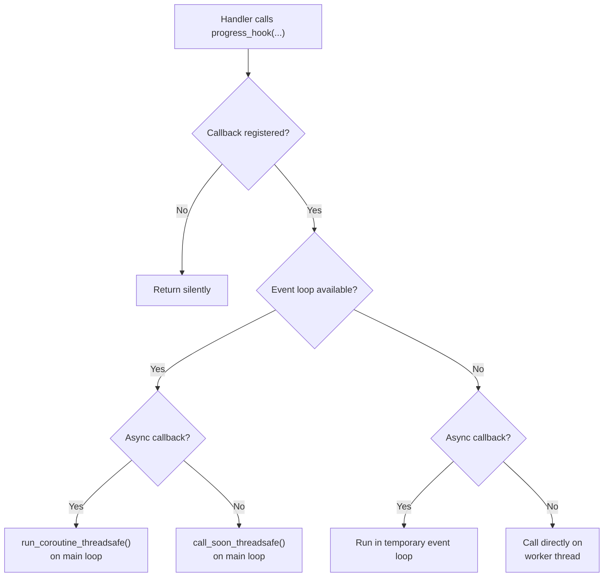
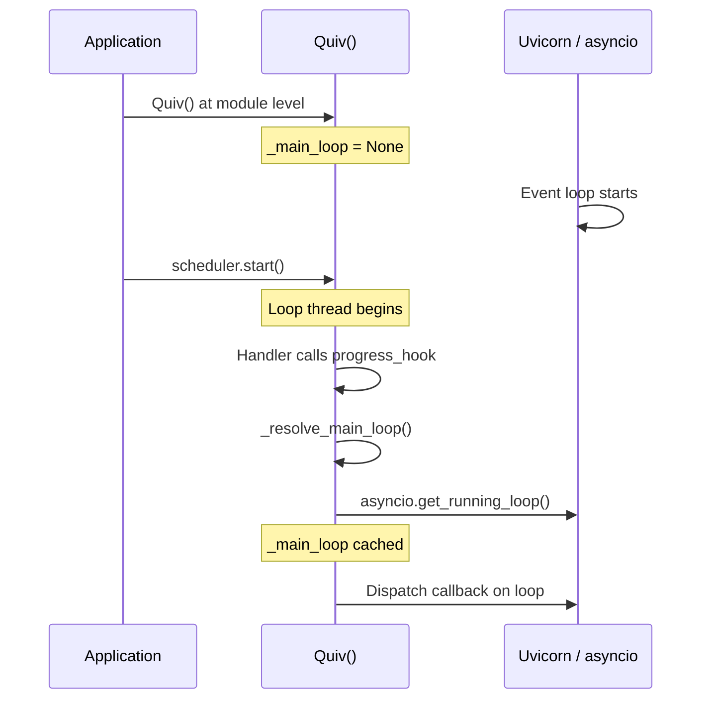
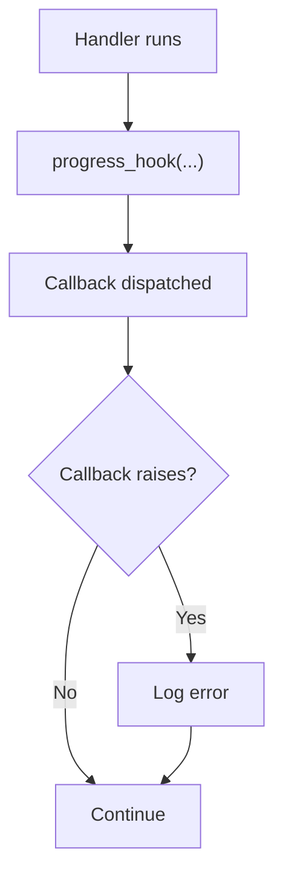

# Progress Callbacks

A progress callback lets a handler report its progress to your application while it runs. Use it to update a user interface, to send a WebSocket message, to record a metric, or to follow a job that takes a long time.

## How it works

When a handler calls `progress_hook(...)`, quiv sends the progress to the callback registered for that task. Two things decide the path it takes: whether an asyncio event loop is available, and whether the callback is sync or async.


```mermaid
flowchart TD
    A["Handler calls progress_hook(...)"] --> B{Callback registered?}
    B -- No --> C[Return silently]
    B -- Yes --> D{Event loop available?}
    D -- Yes --> E{Async callback?}
    D -- No --> F{Async callback?}
    E -- Yes --> G["run_coroutine_threadsafe()
    on main loop"]
    E -- No --> H["call_soon_threadsafe()
    on main loop"]
    F -- Yes --> I["Run in temporary event loop"]
    F -- No --> J["Call directly on
    worker thread"]
```

### The four dispatch paths

| Event loop | Callback type | What quiv does |
|------------|--------------|--------------|
| Available | Async | Sends it to the main loop with `run_coroutine_threadsafe` |
| Available | Sync | Sends it to the main loop with `call_soon_threadsafe` |
| Unavailable | Sync | Calls it on the worker thread |
| Unavailable | Async | Runs it in a temporary event loop on the worker thread |

## Event loop resolution

quiv does **not** need an event loop at startup. It finds the main loop the first time a progress callback fires, and keeps it.


```mermaid
sequenceDiagram
    participant App as Application
    participant Q as Quiv()
    participant UV as Uvicorn / asyncio

    App->>Q: Quiv() at module level
    Note over Q: _main_loop = None
    UV->>UV: Event loop starts
    App->>Q: scheduler.start()
    Note over Q: Loop thread begins
    Q->>Q: Handler calls progress_hook
    Q->>Q: _resolve_main_loop()
    Q->>UV: asyncio.get_running_loop()
    Note over Q: _main_loop cached
    Q->>UV: Dispatch callback on loop
```

You can therefore create `Quiv()` at module level, before FastAPI or uvicorn creates an event loop. Larger applications usually do this.

## Adding a progress callback

Pass `progress_callback` when you add the task:

```python
async def on_progress(**payload):
    print("progress", payload)

scheduler.add_task(
    task_name="my-task",
    func=my_handler,
    interval=60,
    progress_callback=on_progress,
)
```

## Writing a handler that reports progress

Add `progress_hook` to the signature of your handler. quiv reads the signature and injects the hook only when the parameter is there.

!!! warning "Renamed in v1.0.0 — was `_progress_hook`"

    quiv `0.x` injected this parameter as `_progress_hook`. `add_task()` rejects a handler that still declares the old name, and raises `ConfigurationError` that names the new spelling. Rename the parameter. Its behavior is unchanged. See the [v1.0.0 release notes](release-notes.md#v1.0.0).

```python
import threading
from typing import Callable


def process_records(
    batch_size: int,
    stop_event: threading.Event | None = None,
    progress_hook: Callable | None = None,
):
    records = fetch_records(batch_size)
    total = len(records)

    for i, record in enumerate(records, 1):
        if stop_event and stop_event.is_set():
            return

        process(record)

        if progress_hook:
            progress_hook(
                step=i,
                total=total,
                pct=round(i / total * 100),
            )
```

The handler does not need to know whether the callback is sync or async, and it does not need to know whether an event loop exists. It calls `progress_hook(...)`, and quiv chooses the path.

## Async progress callback

An async callback runs on the main event loop, through `run_coroutine_threadsafe`. Use it in a FastAPI application to send updates to WebSocket clients:

```python
from fastapi import WebSocket

connected_clients: list[WebSocket] = []


async def on_progress(**payload):
    for ws in connected_clients:
        await ws.send_json({"event": "progress", "data": payload})


scheduler.add_task(
    task_name="etl-pipeline",
    func=run_etl,
    interval=3600,
    progress_callback=on_progress,
)
```

The callback runs on the event loop of FastAPI, so you can `await` a WebSocket, a database session, or any other async API inside it.

## Sync progress callback

A sync callback looks the same to the handler. When an event loop is available, it runs on the main loop through `call_soon_threadsafe`. When no loop is available, in a plain script for example, it runs on the worker thread.

```python
import logging

logger = logging.getLogger(__name__)


def log_progress(**payload):
    logger.info("Task progress: %s", payload)


scheduler.add_task(
    task_name="cleanup",
    func=cleanup_handler,
    interval=300,
    progress_callback=log_progress,
)
```

## Without an event loop

A sync progress callback still works in a script that does not use asyncio. It runs on the worker thread that runs the handler.

```python
from quiv import Quiv

scheduler = Quiv()


def on_progress(**payload):
    print(f"Step {payload['step']}/{payload['total']}")


def my_task(progress_hook=None):
    for i in range(1, 6):
        if progress_hook:
            progress_hook(step=i, total=5)


scheduler.add_task(
    task_name="script-task",
    func=my_task,
    interval=10,
    progress_callback=on_progress,
)
scheduler.start()
```

An async progress callback works without an event loop too. quiv runs it in a temporary event loop on the worker thread, so an `await` inside the callback runs correctly.

## Error handling

If a progress callback raises an exception, quiv writes the error to the log and the job continues. The job does not fail, and the handler keeps running. One broken callback therefore cannot stop your tasks.


```mermaid
flowchart TD
    A[Handler runs] --> B["progress_hook(...)"]
    B --> C[Callback dispatched]
    C --> D{Callback raises?}
    D -- No --> E[Continue]
    D -- Yes --> F[Log error]
    F --> E
```

## Payload conventions

`progress_hook` accepts any `*args` and any `**kwargs`. quiv enforces no schema. This set of keys works well:

```python
progress_hook(
    step=3,        # current step
    total=10,      # total steps
    stage="load",  # descriptive label
    pct=30,        # percentage complete
)
```

The progress callback receives what the handler passes, and nothing more. quiv reads the `task_id` to find the registered callback, and the dispatch layer keeps it. quiv does not add it to the payload.
