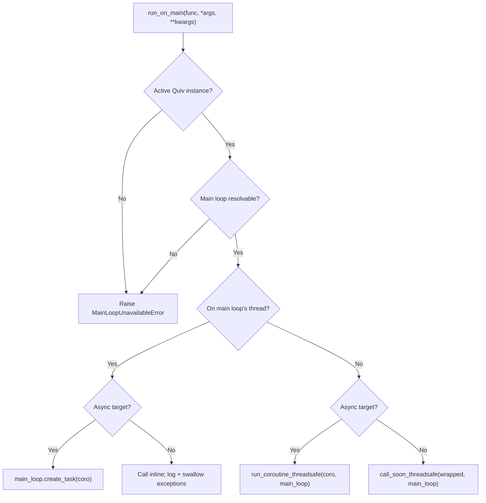
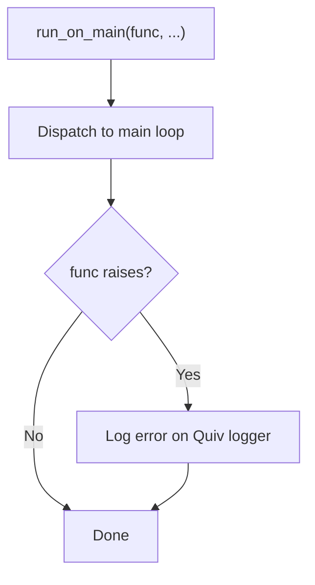

# Running on the main event loop

`quiv.run_on_main` sends a callable to the main event loop. You can call it from anywhere inside the call stack of a task handler, at any depth. It behaves the same way when the caller already runs on the main loop, in a FastAPI route for example.

`run_on_main` starts the work and returns at once. It does not wait for a result, and it does not report one.

Use it when some piece of code must reach a resource that lives on the main loop, such as a WebSocket manager, a queue, or an async client. It saves you from passing a callback parameter through every function in between. The same code can then run from a task handler and from a request handler.

## When to use this, and when to use `progress_hook`

| Use case                                                      | Use                 |
| ------------------------------------------------------------- | ------------------- |
| One progress channel for each task, registered in advance     | `progress_hook`    |
| Occasional work on the main loop, from deeply nested code     | `run_on_main`       |
| One utility called from task code and from route handlers     | `run_on_main`      |

`progress_hook` belongs to one task. quiv sends it only to the `progress_callback` that you registered with `add_task()`. `run_on_main` belongs to the active Quiv instance. It takes any callable, with any arguments, from any depth of any task.

## Basic usage

```python
from quiv import Quiv, run_on_main

scheduler = Quiv()

async def broadcast(message: str) -> None:
    # Runs on uvicorn's main loop where ws_manager lives.
    await ws_manager.broadcast(message)

def level_three() -> None:
    run_on_main(broadcast, "deep call finished")

def level_two() -> None:
    level_three()

def level_one() -> None:
    level_two()

def handler() -> None:
    level_one()

scheduler.add_task(task_name="deep-task", func=handler, interval=60)
scheduler.start()
```

`level_three` needs no injected `progress_hook`, no reference to the scheduler, and no knowledge that a task contains it. It imports `run_on_main` at module level and calls it.

## Dispatch behavior

`run_on_main` checks at the moment of the call whether it already runs on the thread of the main loop. It then chooses the path.



| Caller runs on...         | Sync target                              | Async target                            |
| ------------------------- | ---------------------------------------- | --------------------------------------- |
| The thread of the main loop | An inline call. quiv logs and swallows an exception | `main_loop.create_task(coro)`           |
| A worker thread             | `call_soon_threadsafe`                   | `run_coroutine_threadsafe`              |

Every path returns without a result. A call that crosses threads returns `None` at once, and a failure inside `func` does not reach the caller. See [Exception handling](#exception-handling).

## The same function, in a task or in a route

`run_on_main` finds the active Quiv instance at the moment of the call. You can therefore call one utility function from a task handler and from a FastAPI route on the main loop. A call from the thread of the main loop crosses no thread: a sync target runs inline, and an async target goes onto the current loop.

```python
from quiv import run_on_main

async def notify_clients(payload: dict) -> None:
    await ws_manager.broadcast(payload)

# Called from inside a Quiv task (worker thread):
def task_handler() -> None:
    run_on_main(notify_clients, {"event": "task_done"})

# Called from inside a FastAPI route (main loop):
@app.post("/notify")
async def notify_endpoint(payload: dict) -> dict:
    run_on_main(notify_clients, payload)
    return {"queued": True}
```

## How quiv finds the active instance

At the moment of the call, quiv looks in two places, in this order:

1. A `ContextVar` that `Quiv._run_job` sets for the length of one handler invocation. quiv sets it on the worker thread before the handler runs. It reaches:
    - nested sync function calls,
    - an async handler that runs in the event loop of that job,
    - a task started with `asyncio.create_task` inside an async handler.
2. A process-level instance that `Quiv.start()` registers and `Quiv.shutdown()` clears. This covers a caller that no task contains, such as a FastAPI route handler on the main loop.

If neither holds an instance, `run_on_main` raises `MainLoopUnavailableError`.

!!! info "Multiple Quiv instances"
    If you start more than one Quiv instance at the same time, quiv writes a warning to the log. For a caller outside a task, quiv then uses the instance that started last. Inside a task, the `ContextVar` always points to the instance that scheduled the running job, however many other instances exist.

!!! warning "A thread that you start yourself does not inherit the context"
    Python copies a `ContextVar` into `asyncio.create_task`, but **not** into a `threading.Thread` that you create. If your handler runs `threading.Thread(target=fn).start()` and `fn` calls `run_on_main`, quiv uses the process-level instance instead. That instance is usually the right one, but it is ambiguous when you run several Quiv instances. Start no raw threads inside a handler. The thread pool already runs your work in parallel.

## Exception handling

If `func` raises, `run_on_main` writes the error to the logger of the active Quiv and continues. The code of the caller is not affected. `progress_hook` and the event listeners behave the same way, so one broken callback on the main loop cannot stop the task that called it.



If a failure must reach your code, handle the error inside `func`. Report it through a `progress_callback` or through an event listener.

## Signature and behavior

```python
def run_on_main(
    func: Callable[..., Any],
    *args: Any,
    **kwargs: Any,
) -> None: ...
```

- `func` can be a sync function or a coroutine function (`async def`). `run_on_main` does **not** accept a coroutine object. Pass the function, and `run_on_main` calls it with `*args` and `**kwargs`.
- `run_on_main` returns `None`. It returns at once on every path that crosses threads, and for an async target that it puts on the current loop. One case blocks: a **sync** target called from the thread of the main loop runs inline, on the stack of the caller, and the caller waits for it to finish.
- `run_on_main` raises `MainLoopUnavailableError` when no active Quiv instance is registered, and when the active Quiv has no main loop that it can resolve. Both are configuration faults, such as a call to `run_on_main` before `Quiv.start()`. The exception inherits `QuivError` and `RuntimeError`.

## Waiting for this work at shutdown

`run_on_main` returns as soon as it hands the work over. The job that called it then finishes, and quiv counts that job as complete, although the work itself has not started.

`shutdown()` waits for the scheduler loop and for running jobs. It does **not** wait for work already handed to the main loop, because that work is not a running job.

!!! warning "`shutdown()` alone can cut this work in half"
    A handler that hands over a one-second coroutine and returns makes its job finish in milliseconds. `shutdown()` then finds nothing running and returns at once, measured at about 12 ms, while the coroutine is still waiting its turn on the loop. In a FastAPI application the loop closes soon after the lifespan returns, so that work is **cancelled**, not merely late.

    `shutdown()` writes a warning naming how many callables it left behind.

### `ashutdown()` waits

Use it wherever your shutdown path is a coroutine, which in FastAPI it always is:

```python
@asynccontextmanager
async def lifespan(app: FastAPI):
    scheduler.start()
    yield
    await scheduler.ashutdown()    # waits for run_on_main work too
```

That is the whole change. Nothing else about the pattern moves.

### Why the synchronous one cannot do it

`shutdown()` is a synchronous function, and the lifespan calls it from the thread of the main loop. If it blocked there waiting for main-loop work, it would be waiting for work that needs that very thread to make progress. Measured: such a wait made no progress at all and consumed its whole timeout.

`ashutdown()` is awaited, and awaiting yields the thread. The work it waits on can therefore run. That is the entire difference between the two.

It works in two steps, in this order:

1. `shutdown()` runs on a worker thread, which leaves the loop free. A job that is still finishing can hand over more work, and that work still progresses.
2. Once no job is running, no new work can arrive, so the queue of work already handed over is drained.

### Bounding the wait

`ashutdown(timeout=5.0)` bounds each step separately, so the total can reach twice the value. Work still unfinished at the deadline is left behind, with a warning, so one stuck callable cannot hold up your exit.

With no `timeout` it waits for both steps however long they take, matching `shutdown()`.

### The one case it cannot cover

With a `timeout`, `shutdown()` abandons a job that did not exit in time, and an abandoned job keeps running on its daemon thread. It can hand work over **after** the drain has already finished, and that late handoff is not waited for.

Nothing can close this. The thread cannot be stopped, so there is no point at which no further work can arrive. `ashutdown()` warns when it ends with jobs still running, so you know the queue was not closed.

Without a `timeout` the case does not arise: every job has exited before the drain begins.

### Calling it from another loop

`ashutdown()` is safe to call from a loop other than the one quiv was given. The tracked work belongs to the main loop, so the drain is marshalled there and only its result is awaited where you called it. Awaiting a task across loops raises `ValueError: The future belongs to a different loop`, which is what this avoids.

### What is tracked

All four dispatch shapes, including a **sync** callable sent with `call_soon_threadsafe`, which has no future to await. quiv holds a marker for one of those from the moment it is queued until it has run. Without it, a drain could see an empty set while the callback was still sitting in the loop's ready queue, and return too early.

## A note about blocking the main loop

A **sync** target called from the thread of the main loop runs inline, on the current call stack, exactly as a direct call would. If that target does blocking I/O or heavy work on the CPU, it blocks the loop. `run_on_main` does not add this behavior. It is how a coroutine calls sync code in Python. Pass an async target instead, or move the blocking work to a thread pool yourself.
