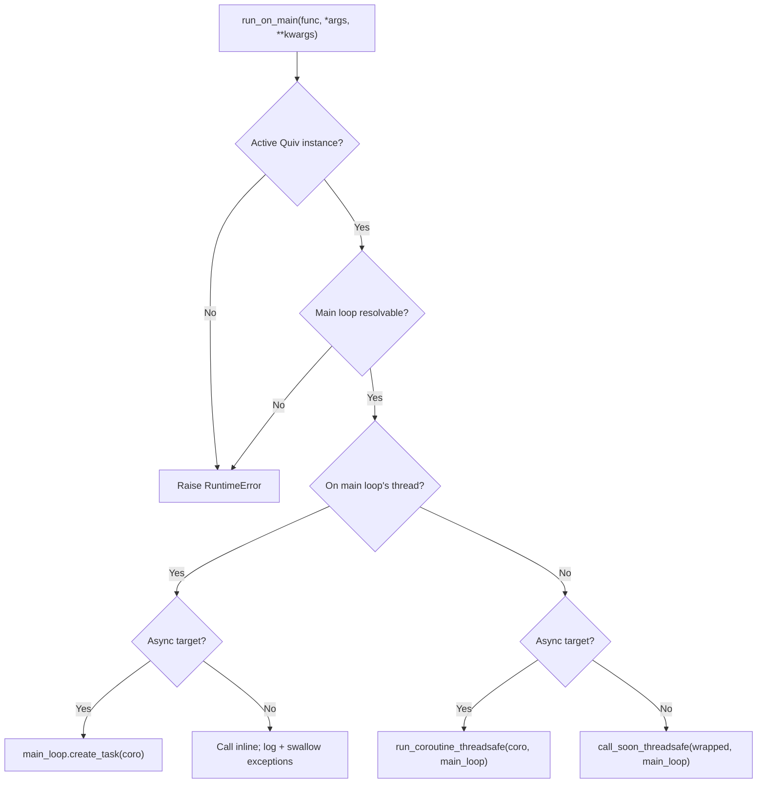
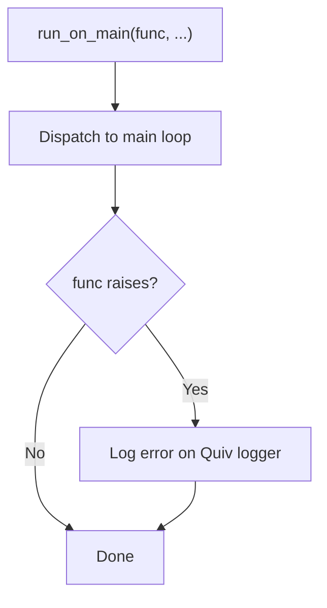

# Running on the main event loop

`quiv.run_on_main` is a fire-and-forget helper that dispatches a callable onto the main event loop from anywhere in a task handler's call stack — no matter how deeply nested — and works identically when called from code already running on the main loop (e.g., a FastAPI route handler).

It is the right tool when a piece of code, sometimes shared between task handlers and request handlers, needs to hop onto the main loop to touch resources that live there (WebSocket managers, background queues, async clients) but you don't want to thread a callback parameter through every intermediate function.

## When to use this vs `_progress_hook`

| Use case                                                      | Reach for           |
| ------------------------------------------------------------- | ------------------- |
| A single progress channel per task, registered up front       | `_progress_hook`    |
| Ad-hoc main-loop work from deeply nested code                 | `run_on_main`       |
| The same utility called from both task code and route handlers | `run_on_main`      |

`_progress_hook` is per-task and is dispatched only to the `progress_callback` you registered with `add_task()`. `run_on_main` is global to the active Quiv instance — any callable, any arguments, called from any depth in any task.

## Basic usage

```python
from quiv import Quiv, run_on_main

scheduler = Quiv()

async def broadcast(message: str) -> None:
    # Runs on uvicorn's main loop where ws_manager lives.
    await ws_manager.broadcast(message)

def level_three() -> None:
    run_on_main(broadcast, "deep call finished")

def level_two() -> None:
    level_three()

def level_one() -> None:
    level_two()

def handler() -> None:
    level_one()

scheduler.add_task(task_name="deep-task", func=handler, interval=60)
scheduler.start()
```

`level_three` does not need `_progress_hook` injected, does not need a scheduler reference, and does not need to know it is inside a task — it just imports `run_on_main` at module level and calls it.

## Dispatch behavior

`run_on_main` checks at call time whether it is already on the main loop's thread and chooses the right dispatch path automatically.



| Caller is on...           | Sync target                              | Async target                            |
| ------------------------- | ---------------------------------------- | --------------------------------------- |
| Main loop's thread        | Inline call (with exception swallowing)  | `main_loop.create_task(coro)`           |
| Worker thread             | `call_soon_threadsafe`                   | `run_coroutine_threadsafe`              |

All paths are **fire-and-forget**: `run_on_main` returns `None` immediately on cross-thread dispatch, and the call to `func` is allowed to fail without affecting the caller — see [Exception handling](#exception-handling).

## Same function, task or route

Because `run_on_main` resolves the active Quiv instance lazily, you can use the same utility function from a task handler **or** from a FastAPI route on the main loop. When called from the main loop's thread, no cross-thread dispatch happens — the sync target runs inline and the async target is scheduled on the current loop.

```python
from quiv import run_on_main

async def notify_clients(payload: dict) -> None:
    await ws_manager.broadcast(payload)

# Called from inside a Quiv task (worker thread):
def task_handler() -> None:
    run_on_main(notify_clients, {"event": "task_done"})

# Called from inside a FastAPI route (main loop):
@app.post("/notify")
async def notify_endpoint(payload: dict) -> dict:
    run_on_main(notify_clients, payload)
    return {"queued": True}
```

## How the active Quiv instance is resolved

Resolution order at call time:

1. A `ContextVar` set by `Quiv._run_job` for the duration of a handler invocation. This is set on the worker thread before the handler runs and propagates into:
    - nested sync function calls,
    - async handlers running in the per-job event loop,
    - `asyncio.create_task` spawned inside an async handler.
2. A process-level fallback registered by `Quiv.start()` and cleared by `Quiv.shutdown()`. This covers callers that are **not** inside a task context, such as FastAPI route handlers on the main loop.

If both are unset, `run_on_main` raises `RuntimeError`.

!!! info "Multiple Quiv instances"
    If more than one Quiv instance is `start()`ed at the same time, a warning is logged and the most recently started instance wins for out-of-task callers. Inside a task, the contextvar always points at the instance that scheduled the running job, regardless of how many other instances exist.

!!! warning "User-spawned threads do not inherit context"
    Python's `ContextVar` is copied into `asyncio.create_task` but **not** into manually-spawned `threading.Thread` objects. If your handler does `threading.Thread(target=fn).start()` and `fn` calls `run_on_main`, the helper falls back to the process-level instance — which is usually still correct, but will be ambiguous if you run multiple Quiv instances. Avoid spawning raw threads from inside a handler if you can; the threadpool already gives you parallelism.

## Exception handling

If `func` raises, `run_on_main` logs the error via the active Quiv's logger and swallows it. The caller's code continues normally. This mirrors `_progress_hook` and event-listener semantics — a broken main-loop callback should never take down the task that triggered it.



If you need failures to propagate, do the error handling inside `func` itself — for example, by reporting back through a `progress_callback` or an event listener.

## Signature and semantics

```python
def run_on_main(
    func: Callable[..., Any],
    *args: Any,
    **kwargs: Any,
) -> None: ...
```

- `func` may be a sync function or a coroutine function (`async def`). Bare coroutine objects are **not** accepted — pass the function and let `run_on_main` invoke it with `*args, **kwargs`.
- Returns `None` immediately.
- Raises `RuntimeError` if no active Quiv instance is registered, or if the active Quiv has no resolvable main loop. These are configuration errors (e.g., `run_on_main` called before `Quiv.start()`).

## A note on blocking the main loop

When called from the main loop's thread with a **sync** target, the target runs inline on the current call stack — exactly as if you had called it directly. If the target does blocking I/O or heavy CPU work it will block the loop. This is not a regression introduced by `run_on_main`; it is how Python coroutines call sync code in general. Use async targets, or schedule the blocking work onto a thread pool yourself.
