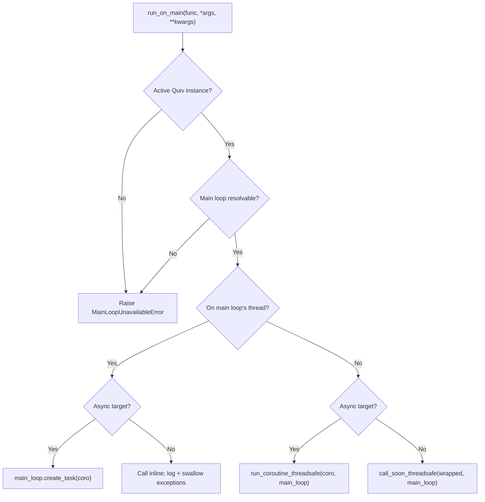
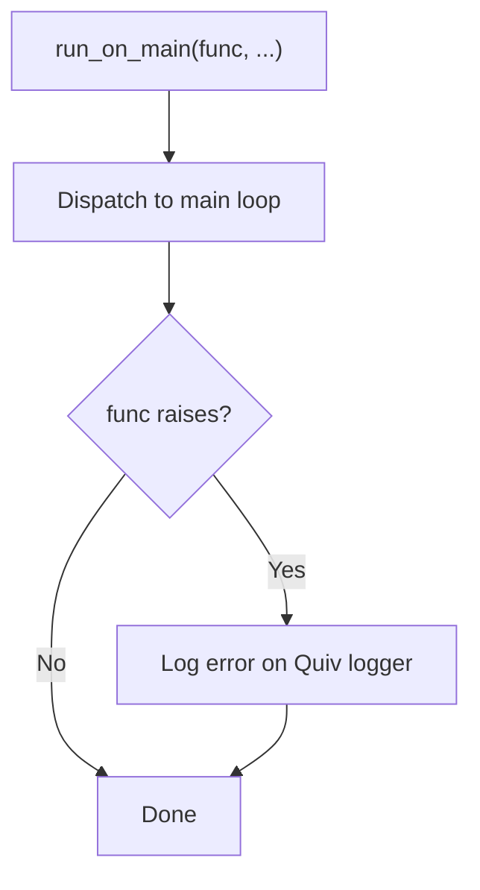

# Running on the main event loop

`quiv.run_on_main` sends a callable to the main event loop. You can call it from anywhere inside the call stack of a task handler, at any depth. It behaves the same way when the caller already runs on the main loop, in a FastAPI route for example.

`run_on_main` starts the work and returns at once. It does not wait for a result, and it does not report one.

Use it when some piece of code must reach a resource that lives on the main loop, such as a WebSocket manager, a queue, or an async client. It saves you from passing a callback parameter through every function in between. The same code can then run from a task handler and from a request handler.

## When to use this, and when to use `progress_hook`

| Use case                                                      | Use                 |
| ------------------------------------------------------------- | ------------------- |
| One progress channel for each task, registered in advance     | `progress_hook`    |
| Occasional work on the main loop, from deeply nested code     | `run_on_main`       |
| One utility called from task code and from route handlers     | `run_on_main`      |

`progress_hook` belongs to one task. quiv sends it only to the `progress_callback` that you registered with `add_task()`. `run_on_main` belongs to the active Quiv instance. It takes any callable, with any arguments, from any depth of any task.

## Basic usage

```python
from quiv import Quiv, run_on_main

scheduler = Quiv()

async def broadcast(message: str) -> None:
    # Runs on uvicorn's main loop where ws_manager lives.
    await ws_manager.broadcast(message)

def level_three() -> None:
    run_on_main(broadcast, "deep call finished")

def level_two() -> None:
    level_three()

def level_one() -> None:
    level_two()

def handler() -> None:
    level_one()

scheduler.add_task(task_name="deep-task", func=handler, interval=60)
scheduler.start()
```

`level_three` needs no injected `progress_hook`, no reference to the scheduler, and no knowledge that a task contains it. It imports `run_on_main` at module level and calls it.

## Dispatch behavior

`run_on_main` checks at the moment of the call whether it already runs on the thread of the main loop. It then chooses the path.



| Caller runs on...         | Sync target                              | Async target                            |
| ------------------------- | ---------------------------------------- | --------------------------------------- |
| The thread of the main loop | An inline call. quiv logs and swallows an exception | `main_loop.create_task(coro)`           |
| A worker thread             | `call_soon_threadsafe`                   | `run_coroutine_threadsafe`              |

Every path returns without a result. A call that crosses threads returns `None` at once, and a failure inside `func` does not reach the caller. See [Exception handling](#exception-handling).

## The same function, in a task or in a route

`run_on_main` finds the active Quiv instance at the moment of the call. You can therefore call one utility function from a task handler and from a FastAPI route on the main loop. A call from the thread of the main loop crosses no thread: a sync target runs inline, and an async target goes onto the current loop.

```python
from quiv import run_on_main

async def notify_clients(payload: dict) -> None:
    await ws_manager.broadcast(payload)

# Called from inside a Quiv task (worker thread):
def task_handler() -> None:
    run_on_main(notify_clients, {"event": "task_done"})

# Called from inside a FastAPI route (main loop):
@app.post("/notify")
async def notify_endpoint(payload: dict) -> dict:
    run_on_main(notify_clients, payload)
    return {"queued": True}
```

## How quiv finds the active instance

At the moment of the call, quiv looks in two places, in this order:

1. A `ContextVar` that `Quiv._run_job` sets for the length of one handler invocation. quiv sets it on the worker thread before the handler runs. It reaches:
    - nested sync function calls,
    - an async handler that runs in the event loop of that job,
    - a task started with `asyncio.create_task` inside an async handler.
2. A process-level instance that `Quiv.start()` registers and `Quiv.shutdown()` clears. This covers a caller that no task contains, such as a FastAPI route handler on the main loop.

If neither holds an instance, `run_on_main` raises `MainLoopUnavailableError`.

!!! info "Multiple Quiv instances"
    If you start more than one Quiv instance at the same time, quiv writes a warning to the log. For a caller outside a task, quiv then uses the instance that started last. Inside a task, the `ContextVar` always points to the instance that scheduled the running job, however many other instances exist.

!!! warning "A thread that you start yourself does not inherit the context"
    Python copies a `ContextVar` into `asyncio.create_task`, but **not** into a `threading.Thread` that you create. If your handler runs `threading.Thread(target=fn).start()` and `fn` calls `run_on_main`, quiv uses the process-level instance instead. That instance is usually the right one, but it is ambiguous when you run several Quiv instances. Start no raw threads inside a handler. The thread pool already runs your work in parallel.

## Exception handling

If `func` raises, `run_on_main` writes the error to the logger of the active Quiv and continues. The code of the caller is not affected. `progress_hook` and the event listeners behave the same way, so one broken callback on the main loop cannot stop the task that called it.



If a failure must reach your code, handle the error inside `func`. Report it through a `progress_callback` or through an event listener.

## Signature and behavior

```python
def run_on_main(
    func: Callable[..., Any],
    *args: Any,
    **kwargs: Any,
) -> None: ...
```

- `func` can be a sync function or a coroutine function (`async def`). `run_on_main` does **not** accept a coroutine object. Pass the function, and `run_on_main` calls it with `*args` and `**kwargs`.
- `run_on_main` returns `None`. It returns at once on every path that crosses threads, and for an async target that it puts on the current loop. One case blocks: a **sync** target called from the thread of the main loop runs inline, on the stack of the caller, and the caller waits for it to finish.
- `run_on_main` raises `MainLoopUnavailableError` when no active Quiv instance is registered, and when the active Quiv has no main loop that it can resolve. Both are configuration faults, such as a call to `run_on_main` before `Quiv.start()`. The exception inherits `QuivError` and `RuntimeError`.

## Waiting for the result with `call_on_main`

`run_on_main` hands the work over and returns. `call_on_main` hands the work over and waits:

```python
from quiv import call_on_main

def handler():
    total = call_on_main(recompute_totals)   # runs on the main loop; this thread waits
    log.info("recomputed %d rows", total)
```

Same dispatch, same active instance, same reach. Three things differ. The result comes back. An exception raised by the target reaches the handler, so the job fails, `JOB_FAILED` fires, and `max_retries` applies. And the job's stop event ends the wait: when `cancel_job()`, `remove_task()`, `shutdown()`, or the task's `timeout` sets it, quiv cancels the coroutine on the main loop and raises `JobCancelledError` in the handler. Let that propagate; the job finalizes as `cancelled` with no error in the log.

This matters for a handler whose whole body is one hop. With `run_on_main` such a handler returns in a millisecond, and the job history shows a millisecond success whatever the work did. A task `timeout` can never fire, because the job has already ended. With `call_on_main` the job spans the work.

Every keyword goes to the target, so `call_on_main` has no options of its own. From the main loop's own thread a sync target runs inline, as it does for `run_on_main`. An async target raises `MainLoopUnavailableError` there, because waiting would block the loop that must run it; await it instead.

The work counts in `pending_main_loop_work()` while it runs. A job that `shutdown(timeout=...)` abandons while it waits leaves that count above zero, which is correct: the work is still on your loop.

## This work outlives shutdown, and closing the loop is yours

`run_on_main` returns as soon as it hands the work over. The job that called it then finishes, and quiv counts that job as complete, although the work itself has not started.

`shutdown()` waits for the scheduler loop and for running jobs. It does **not** wait for work already handed to the main loop, and it does not cancel it.

!!! info "That loop is yours, not quiv's"
    You created the event loop and you close it. quiv is a guest on it. It never closes the loop, never cancels what is queued there, and has no way to know whether a half-finished callable should be stopped or allowed to end. Only your application knows that.

    So quiv does the one thing a guest can do honestly: it tells you what is still outstanding.

A handler that hands over a one-second coroutine and returns makes its job finish in milliseconds, so `shutdown()` finds nothing running and returns at once, measured at about 12 ms. If your loop closes straight afterwards, that coroutine is cancelled.

### `shutdown()` says what it left

```
WARNING Quiv: 2 callable(s) handed to the main loop by run_on_main have not
finished. quiv cannot stop them: the loop belongs to your application, and
quiv never closes it or cancels what is queued on it. Check
pending_main_loop_work() before closing the loop.
```

Silence was the real hazard. Work vanished with nothing in the log to explain it.

### `pending_main_loop_work()` is the number to act on

```python
@asynccontextmanager
async def lifespan(app: FastAPI):
    scheduler.start()
    yield
    scheduler.shutdown()
    while scheduler.pending_main_loop_work():
        await asyncio.sleep(0.05)
```

You are on the loop in the lifespan, so awaiting yields the thread and the outstanding work runs. Bound the wait however your application wants to: a deadline, a cap on iterations, or not at all if the work is a broadcast you are happy to drop.

It is cheap enough to poll. It reads one set under a lock and never touches the database, unlike `stats()`.

### What it counts

Every shape `run_on_main` dispatches, including a **sync** callable sent with `call_soon_threadsafe`, which has no future of its own. quiv holds a marker for one of those from the moment it is queued until it has run, so the count never reads zero while a callback is still sitting in the loop's ready queue.

## A note about blocking the main loop

A **sync** target called from the thread of the main loop runs inline, on the current call stack, exactly as a direct call would. If that target does blocking I/O or heavy work on the CPU, it blocks the loop. `run_on_main` does not add this behavior. It is how a coroutine calls sync code in Python. Pass an async target instead, or move the blocking work to a thread pool yourself.
